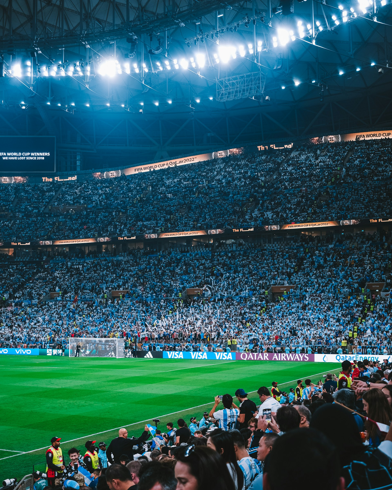
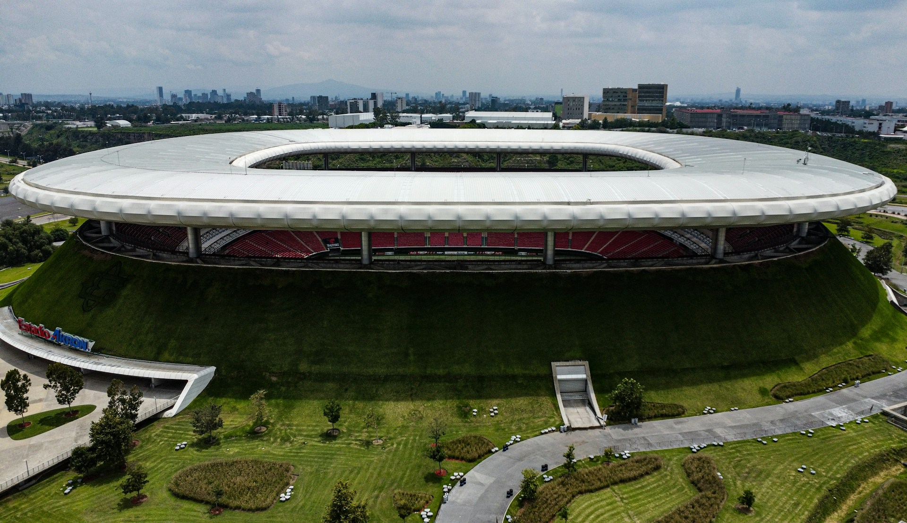
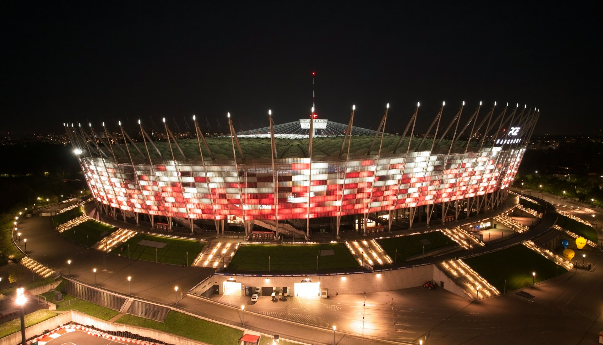

# 小红书砸17亿买世界杯，图什么？

> 来源: 澎湃新闻/36氪/封面新闻/中国日报 | 热点: 小红书官宣获得2026美加墨世界杯持权转播商
> 日期: 2026年5月28日
> 封面: cover.jpg

---

*图片来源：Unsplash（免费授权）*

今天，小红书官宣成为2026年美加墨世界杯持权转播商。

全部104场赛事，直播、回放、精彩集锦，免费看。

范志毅、谢晖等名嘴全程解说。

消息一出，评论区热闹了："小红书也要搞体育了？""看球还要再下一个App？"

这两个问题，恰恰是小红书砸下重金要回答的。

## 17亿买的不只是版权

先说价格。多方消息源报道，小红书拿下这届世界杯转播权的总投入约17亿元。

这个数字什么概念？超过了传统转播巨头咪咕的过往报价。但知情人士向澎湃新闻透露，版权价格本身并未高于往届，17亿里还包含了在央视直播信号中的品牌植入广告费。

也就是说，小红书不只是买了一个播放权，还买了一个面向全国球迷的品牌曝光入口。

版权模式延续了"央视总包+平台分销"的成熟路径：央视自有平台+咪咕+小红书，小红书是公共互联网领域唯一被许可方。这意味着在抖音、快手、B站等平台上，你只能看到二次创作，看不到完整直播。

独家，是这17亿的第一层价值。

## 从1.7亿日活到2亿

*图片来源：Unsplash（免费授权）*

小红书目前的日活用户超过1.7亿，月活突破4亿。内部目标很明确：借世界杯冲击2亿日活。

增加3000万日活，值17亿吗？

算一笔账。小红书的核心变现方式是广告，广告收入与日活和用户时长正相关。世界杯赛程长达40天，如果每天能吸引新增用户打开App、停留、互动，这些用户在赛事结束后大概率会沉淀一部分。

更重要的是，小红书要突破一个增长瓶颈：**内容品类的天花板**。

小红书起家于生活方式分享，用户画像偏年轻、偏一二线城市。这既是优势——社区氛围好、用户粘性高、广告主愿意买单；也是天花板——在中国互联网增长红利见顶的背景下，单靠现有品类很难再翻倍。

世界杯是全球最大的体育IP，在中国拥有数亿球迷。这批人平时未必会打开小红书，但为了看球会来。来了之后呢？小红书的内容推荐算法会让他们看到什么？足球装备测评、运动穿搭、观赛零食、旅行攻略……

这就是小红书的算盘：用世界杯把体育人群引进来，用内容生态把他们留住。

## 两条商业变现线

小红书方面透露了本届世界杯的两条商业化路径：

**第一条是直播线。** 平台首次全面开放赛事直播间品牌合作，涵盖直播流内贴片、互动竞猜冠名、演播厅节目植入等。简单说，你在小红书看球的同时，会看到品牌广告。

**第二条是视频切片线。** 依托官方版权，赛事集锦、球星高光、比赛回放在站内持续高频流通。短视频的曝光生命周期远超赛事本身——一场比赛90分钟，但精彩进球的短视频可以在平台上传播数周。

这两条线的协同效应在于：直播带来即时流量，短视频带来长尾流量。40天赛程结束后，世界杯相关内容仍然能在小红书上持续产生广告价值。

## 一场关于"用户争夺"的战争

*图片来源：Unsplash（免费授权）*

放在更大的格局里看，小红书买世界杯不是孤立事件。

过去几年，抖音拿过世界杯，咪咕拿过世界杯，优酷拿过世界杯。每一家买版权的平台，目的都不只是"让用户看球"，而是"让用户留下来"。

小红书的差异化在于：它不是体育平台，而是生活方式平台。它不需要和咪咕比解说专业度，也不需要和抖音比短视频分发效率。它要做的，是把足球变成一种生活方式——不只是看球，而是穿搭、美食、旅行、社交。

这个定位如果成立，世界杯就不是一个40天的流量活动，而是小红书从"生活方式社区"走向"全民内容平台"的关键一步。

17亿贵不贵？要看小红书能不能把因为看球而来的人变成日常活跃用户。如果能，这笔钱花得值。如果不能，那就是一次昂贵的品牌广告。

答案要等到世界杯结束后的下一个季度财报才能揭晓。

但至少，小红书敢于在一个"不属于自己"的赛道上砸下重金。这份野心本身，就值得尊重。

---

## 参考来源

1. [澎湃新闻：《小红书成美加墨世界杯持权转播商，版权价格并未高于往届》](http://m.toutiao.com/group/7644752729247875634/)，2026年5月28日
2. [36氪：《小红书入局世界杯：这是一场"用户争夺"赛？》](https://36kr.com/p/3828389121675912)，2026年5月28日
3. [封面新闻：《拿到世界杯转播权的小红书要拿下男性用户》](http://m.toutiao.com/group/7644770439272710682/)，2026年5月28日
4. [中国日报：《小红书官宣获得世界杯版权，用户可免费观看全部104场赛事》](http://m.toutiao.com/group/7644776503724524086/)，2026年5月28日
5. [36氪：《小红书为什么要买世界杯？》](https://36kr.com/p/3827553244176393)，2026年5月28日

---

*叶芝说 · 科技评论*
*2026年5月28日*
