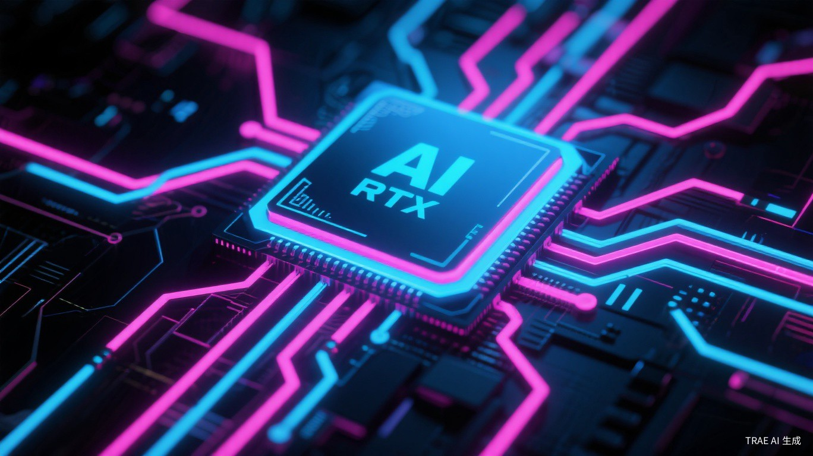

# 英伟达杀入PC芯片：40年来第一次，PC被重新定义

黄仁勋在台北GTC的演讲持续了将近两小时。当他说出"我们正在与微软彻底重新建构PC"这句话时，台下掌声雷动。

这不是场面话。6月1日，英伟达正式发布RTX Spark超级芯片，宣布进军Windows PC处理器市场。戴尔、联想、惠普、华硕、微星、微软六大OEM全线跟进，首批设备今年秋季上市。

英特尔和AMD垄断PC芯片40年的格局，第一次出现了真正的裂缝。

## 700亿晶体管的怪物

RTX Spark的硬件规格堪称残暴。

台积电3纳米工艺，700亿个晶体管，20核Grace CPU，6144个CUDA核心的Blackwell架构GPU，128GB统一内存，1 Petaflop（千万亿次）本地AI算力。

这些数字意味着什么？

英伟达官方的说法是：能本地流畅运行高级AI智能体、渲染超大规模3D场景、剪辑12K超高清视频。产品管理总监马克·艾弗曼更直接：图形处理能力"大致相当于"RTX 5070，CPU性能"有望与Windows平台上的任何其他产品相媲美"。

翻译一下：这是一颗能在轻薄本上跑2000亿参数大模型的芯片。

对比一下英特尔同期旗舰移动处理器，AI算力约100 TOPS。RTX Spark是它的10倍以上。再加上128GB统一内存——CPU和GPU共享高速内存池，数据交换不再是瓶颈。

金元证券的研报说得明白：RTX Spark标志着AI Agent正从云端下沉到本地终端，AI PC从"具备NPU的办公电脑"升级为"可本地运行大模型与Agent的个人AI计算平台"。

## 微软为什么站队

英伟达做PC芯片不是新闻。新闻是微软的态度。

黄仁勋透露，双方在这个项目上已经合作三年。RTX Spark将独家预装Windows 11 AI PC系统，原生支持Copilot+加速。

微软的算盘不难理解。Windows on Arm喊了很多年，但高通骁龙X Elite的表现只能说差强人意。现在英伟达带着完整的CUDA生态和碾压级的AI算力入场，微软终于找到了能跟苹果Apple Silicon正面刚的筹码。

更重要的是，微软和英伟达对PC的未来有共同想象：AI智能体取代鼠标键盘，成为人机交互的主要方式。

黄仁勋的比喻很形象：传统CPU是为活在秒级世界的人类设计的，而智能体"活在纳秒的世界里"。未来的PC用户不再需要手动执行复杂工作流程，只需向AI代理发出指令，它就能自动完成所有操作。

## 英特尔的噩梦

市场反应说明了一切。

发布会当天，英伟达和微软股价盘后涨约2.3%，英特尔和AMD跌近1%。高通更惨，暴跌9.5%——毕竟Windows on Arm的垄断地位被打破了。

英特尔面临的麻烦是结构性的。

x86架构需要靠分立NPU提升AI性能，目前只有40-50 TOPS。而RTX Spark的"统一内存SoC"方案能高效支撑大模型本地化，技术代差显著。再加上Arm架构的能效优势——续航是英特尔芯片的2.5倍——高端创作本市场正在被侵蚀。

英特尔不是没有反击。同一天，英特尔发布了至强6+数据中心芯片，并计划在年底推出名为"Crescent Island"的平价AI推理芯片。但消费端的劣势短期内难以弥补。

IDC全球研究副总裁王吉平的评价很中肯：英伟达的芯片架构思路非常适应当前AI终端的发展趋势，CPU与NPU混合架构能够做到取长补短。但ARM架构PC的生态环境仍是天然壁垒，商用市场的严苛检验也还在后面。

## 不只是芯片战争

RTX Spark的真正野心，不止于抢英特尔的市场份额。

英伟达在走苹果Apple Silicon的垂直整合路径：把CPU、GPU与AI运算单元整合为单颗SoC，直接向整机厂商输出完整计算平台。目标是整个Windows阵营。

这意味着什么？

以前英伟达在PC价值链里只是"显卡供应商"，现在变成了"计算平台提供商"。地位变化带来的利润变化，可以参考苹果——自研芯片的毛利率远高于外购。

更长远来看，英伟达正在构建从数据中心到终端设备的完整AI生态。Vera CPU量产、RTX Spark进军PC、与宇树合作做人形机器人——黄仁勋的版图越来越大。

## 30%市场份额的目标

有分析师预测，英伟达的目标是到2027年拿下30%的PC市场份额。

这个数字听起来激进，但也不是不可能。六大OEM的支持已经到位，30余款设备秋季上市，后续还将扩展至约30款笔记本和逾10款台式机。

当然，挑战依然存在。RTX Spark初期定价较高（设备预计1.5万-3.5万元），工业软件和3A游戏的ARM兼容性依赖转译层，性能损耗最高23%。软件生态的完善需要时间。

但趋势已经很明显了。PC行业的天平正在从x86向Arm倾斜，AI算力正在成为新的竞争焦点。英特尔和AMD如果不能快速跟进，市场份额被蚕食只是时间问题。

黄仁勋说，这是40年来PC第一次被彻底重新设计。

他说得没错。上一次是Windows 95开启了个人计算的普及，这一次，个人电脑正在被重新发明。

---

*参考来源：*
- [英伟达联手微软，能否定义未来电脑](http://m.toutiao.com/group/7646580310938829346/)，澎湃新闻，2026年6月2日
- [两大芯片巨头互攻：英伟达杀入PC市场，英特尔将推更便宜的AI芯片](http://m.toutiao.com/group/7646324159668060718/)，界面新闻，2026年6月2日
- [NVIDIA正式发布RTX Spark：携Blackwell与Grace杀入消费级PC处理器市场](http://m.toutiao.com/group/7646331322855637510/)，今日头条，2026年6月2日
- [英伟达发布人工智能PC芯片，聚焦三只受益股及英特尔面临的结构性风险](http://finance.sina.cn/2026-06-02/detail-inhzxvtz4870344.d.html)，新浪财经，2026年6月2日
- [英伟达推出RTX Spark芯片进军PC市场，传统巨头英特尔和高通将面临怎样的生存危机？](https://news.sina.cn/bignews/insight/2026-06-02/detail-inhzynrx1784590.d.html)，新浪新闻，2026年6月2日
- [NVDA RTX Spark CPU Targets 30% PC Market Share by 2027](https://rockstarmarkets.com/news/2026/06/01/nvda-rtx-spark-pc-cpu-launch-computex-edge-shift-1316)，RockstarMarkets，2026年6月1日
- [GeForce @ COMPUTEX 2026: NVIDIA RTX Spark Unveiled](https://www.nvidia.com/en-in/geforce/news/computex-2026-nvidia-geforce-rtx-announcements/)，NVIDIA官方，2026年6月1日

<small>本文配图均来自Unsplash，遵循免费使用授权。</small>
