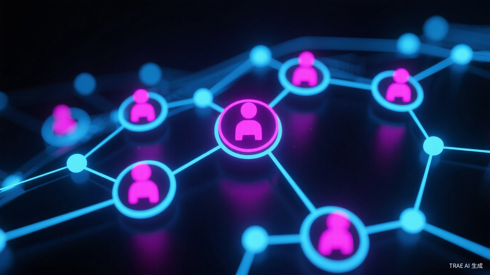

# 别再造Super Agent了，2026年的答案是"分工"

2024年，ChatGPT首次展示工具调用能力时，很多人以为那就是Agent的终极形态——一个超级聪明的AI，什么都能干。

两年过去，这个幻想破灭了。

Google Research今年初做了一个大规模实验：评估180种Agent配置，覆盖单Agent、多Agent独立、中心化、去中心化、混合五种架构。结论很直接——"更多Agent更好"是错的。多Agent协作在并行任务上确实强，但在串行任务上反而 degrade。

微软研究院的CORPGEN项目更残酷：当并发任务从12个增至46个，主流Agent系统的完成率从16.7%暴跌到8.7%。

2026年的行业共识已经形成：与其追求全能的Super Agent，不如构建专业分工的Agent集群。

## 单Agent的三重诅咒

先说说为什么Super Agent行不通。

**第一重：上下文窗口的诅咒。** 即使是最先进的模型，128K甚至1M的上下文窗口，在面对复杂业务流程时仍显捉襟见肘。当Agent需要同时维护长期记忆、当前任务状态、工具调用历史和多轮对话时，信息压缩导致的精度损失呈指数级上升。

**第二重：工具过载。** 研究表明，当可用工具超过15个时，错误调用率从5%飙升至35%以上。Harness MCP Server v1就踩过这个坑——130多个工具定义，吃掉了LLM 26%的上下文窗口，Agent还没开始推理就已经气喘吁吁。

**第三重：认知负荷的单点瓶颈。** 人类不会让一个员工同时担任产品经理、架构师、开发工程师和测试QA。同理，让单个Agent承担规划、执行、验证、反思的全流程，本质上是反模式设计。

Harness的工程师在博客里说了一句很到位的话："你让LLM做路由层，是在逼它干一件switch statement干得更好的事。"

## 四大架构模式

2026年，Multi-Agent架构已经收敛到四种成熟的设计模式。

**模式一：层级化指挥链（Chain of Command）**

模拟军事指挥体系。一个规划Agent担任指挥官，负责任务分解和进度监控；多个执行Agent分别负责前端、后端、测试等具体工作；监控Agent充当情报官，实时汇报状态。

LangGraph的Supervisor模式是典型实现。优势是责任清晰、易于调试；劣势是中心节点可能成为瓶颈。适合软件开发全流程、复杂数据分析管道这类场景。

**模式二：去中心化协作网络（Swarm Intelligence）**

OpenAI Swarm框架的设计理念——没有中心节点，每个Agent根据上下文自主决定下一步动作，包括将任务转交给其他Agent。

优势是高度灵活，天然支持动态负载均衡，单个Agent故障不会导致系统瘫痪。劣势也明显：调试困难，可能出现循环调用，收敛性无法保证。

**模式三：管道流水线（Pipeline Pattern）**

将任务分解为固定阶段，数据单向流动：输入 → 理解 → 规划 → 执行 → 验证 → 输出。CrewAI的Process.sequential模式走的就是这条路。

关键是每个阶段的输出必须严格定义Schema，阶段之间插入中间状态持久化，支持断点续传。这种模式最适合标准化程度高的业务流程。

**模式四：竞争与评审（Adversarial & Review）**

引入对抗机制提升输出质量。生成Agent负责产出，批判Agent负责审查并提出改进意见。微软AutoGen在代码生成场景中采用此模式，生成质量提升40%以上。

更激进的做法是多Agent评审团——模拟人类Code Review流程，多个专业Agent从安全性、性能、可维护性等维度并行评审。

## 通信协议：从自然语言到结构化消息

早期Multi-Agent系统最大的坑，是Agent之间用自然语言交流。

看似灵活，实则灾难：解析不可靠、歧义导致错误级联、难以追踪和调试。2026年的推荐方案是结构化通信——定义严格的AgentMessage接口，包含messageId、from、to、type、payload、timestamp等字段。

更重要的是协议标准化。MCP（Model Context Protocol）解决Agent与工具的互操作，A2A（Agent-to-Agent）解决Agent之间的协调，A2UI解决Agent与用户界面的交互。一个MCP Server可以同时服务Claude、GPT、DeepSeek等多个模型，真正实现"一次开发，多端复用"。

Harness MCP v2的注册表分派模型就是一个典范：11个通用动词（list、get、create、update、delete等）+ 125+资源类型的注册表，上下文成本从26%压到1.6%。

## 记忆系统的三层进化

Agent集群要协作，记忆系统必须升级。

早期方案是全量上下文注入，受token窗口限制，成本高昂。2.0阶段是RAG，按需检索但语义碎片化。3.0阶段是Agentic RAG + GraphRAG，主动检索加知识图谱结构化。

2026年的突破是长期记忆产品化。Letta（前身MemGPT）通过虚拟内存管理，让Agent像操作系统一样管理上下文窗口——热数据留在注意力窗口，温数据存短期记忆，冷数据归档到长期存储。

微软CORPGEN的分级记忆系统更进一步：工作记忆保持当前任务上下文，情景记忆存储历史事件，语义记忆提炼知识和规律。配合自适应摘要技术，记忆增长被有效控制。

这才是从"工具"到"存在"的一步。

## 为什么现在才行得通

Multi-Agent不是新概念。2024年就有人提，但那时候不行，因为基础设施没准备好。

2026年不同了。MCP成为事实标准，A2A进入W3C提案，向量数据库成熟，推理模型（o系列、DeepSeek-R1）让Agent真正会思考。Gartner预测年底40%企业应用将内嵌Agent，80%的组织报告已带来可衡量ROI。

但最大的变化是认知层面的——行业终于意识到，智能不是来自单个Agent的能力堆砌，而是来自多Agent协作涌现的集体智慧。

Google Research的实验给出了定量证据：在并行化任务上，多Agent架构的完成率显著高于单Agent；但在串行任务上，额外的协调开销反而拖慢整体进度。关键是匹配——让架构适配任务特性，而不是反之。

Harness的博客里有一个精妙的类比：Agent循环 behaving like an operating system boundary。LLM是推理引擎，上下文窗口是工作内存，工具调用是系统调用，MCP Server是内核。这个类比的价值在于，它把Agent设计从"prompt engineering"提升到了"system architecture"的层面。

## 一个务实的判断

2026年不是Agent元年，是Harness元年。

Agent本身的能力提升当然重要，但真正决定能否规模化的，是orchestration、monitoring、governance这层基础设施。微软CORPGEN暴露的8.7%完成率，Harness v1的26%上下文成本，都是工程化不足的代价。

好消息是，这些问题正在被系统性解决。四大架构模式提供了可复用的设计模板，三大协议（MCP/A2A/A2UI）定义了互操作标准，分级记忆和自适应摘要解决了状态管理难题。

对于开发者来说，2026年的最佳实践很清楚：不要造Super Agent，造Agent集群。给每个Agent一个明确的角色、有限的工具、清晰的接口。让它们在结构化协议下协作，在分级记忆中学习，在生命周期钩子中保持安全。

这不是退化，是进化。从单细胞到多细胞，从个体到社会——智能的跃迁从来都是组织方式的跃迁。

---

*参考来源：*
- [Towards a science of scaling agent systems](https://research.google/blog/towards-a-science-of-scaling-agent-systems-when-and-why-agent-systems-work/)，Google Research，2026年1月
- [CORPGEN advances AI agents for real work](https://www.microsoft.com/en-us/research/blog/corpgen-advances-ai-agents-for-real-work/)，微软研究院，2026年2月
- [Architecting MCP for AI Agents](https://www.harness.io/blog/harness-mcp-server-redesign)，Harness Blog，2026年3月
- [The Agent Loop Is the New OS](https://www.harness.io/blog/agent-loop-new-os)，Harness Blog，2026年4月
- [2026年AI Agent架构演进](https://juejin.cn/post/7637761828793892873)，稀土掘金，2026年5月
- [智能体时代的技术跃迁](https://cloud.tencent.com/developer/article/2674824)，腾讯云，2026年5月
- [The 2026 State of AI Agents Report](https://resources.anthropic.com/hubfs/The%202026%20State%20of%20AI%20Agents%20Report.pdf)，Anthropic，2026年

<small>本文配图均来自Unsplash，遵循免费使用授权。</small>
