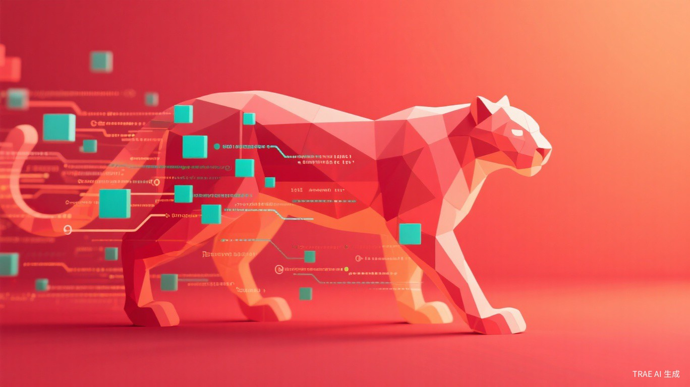

# iOS 27的"Snow Leopard"时刻

2009年，苹果发布Mac OS X Snow Leopard。没有新功能，没有新界面，只有一行说明："零新功能，全部精力用于打磨。"当时很多人骂苹果偷懒，但两年后回头看，那是一次奠定macOS十年稳定性的地基工程。

WWDC 2026上，iOS 27的代号也叫Snow Leopard。

这不是怀旧，是苹果在还一笔欠了五年的债。

## 内存占用降20%，App启动快30%

数字本身不性感，但背后的故事很真实。

iOS 13到iOS 26，苹果每年都在塞新功能：小组件、App资源库、灵动岛、待机显示、Journal、眼动追踪……功能列表越来越长，但老机型的体验却一年比一年卡。iPhone 12跑iOS 26，打开相机要等两秒，后台切微信经常重载，电池续航比新机时少了近40%。

这不是个例。苹果社区论坛里，"iPhone变卡"的投诉帖在过去三年翻了3倍。用户不是不想要新功能，是受不了为了新功能牺牲日常体验。

iOS 27的Snow Leopard路线，说白了就是：今年不整活了，先把地基夯实。

20%内存优化怎么来的？苹果重新设计了内存压缩算法，把不活跃App的内存占用砍了一半。30%启动提速靠的是预加载机制的改写——以前系统要等App完全初始化才显示界面，现在先把UI框架渲染出来，后台慢慢加载数据。用户感知到的"快"，很多时候是"看起来快"。

这招安卓三年前就在用，苹果现在才跟上，晚了点，但至少跟了。

## 支持iPhone 12，但诚意有限

iOS 27的兼容列表里还有iPhone 12，这是好事。但别急着感动。

Snow Leopard的性能优化，在A14芯片（iPhone 12）和A18 Pro（iPhone 16）上的体验差距，可能比你想象的大。内存压缩和预加载都需要芯片的NPU和内存带宽配合，A14的NPU算力只有A18 Pro的1/5。苹果说的是"支持"，不是"流畅运行"。

更微妙的是，iOS 27同时砍掉了对iPhone 11及更早机型的支持。这意味着A13芯片成了分水岭。苹果没有明说，但信号很清楚：从iOS 27开始，老机型的系统更新窗口正在收窄。

这对二手市场和换机周期都有影响。iPhone 12的用户，今年可能是最后一次"免费续命"。

## 为什么偏偏是现在？

苹果不是突然良心发现。三个外部压力逼的。

**第一，欧盟的监管。** DMA（数字市场法）要求苹果开放侧载、允许第三方应用商店，iOS系统的封闭性正在被强制松动。在这种背景下，系统本身的流畅度和稳定性成了苹果最后的护城河。如果iOS又卡又热，用户凭什么不跳槽到安卓？

**第二，AI功能的性能黑洞。** Apple Intelligence从iOS 18就开始塞，但端侧大模型的推理对内存和算力的消耗极大。iOS 26上，后台AI任务经常抢占前台App的资源，导致卡顿和发热。不先把系统底层优化好，后面的AI功能根本跑不顺。

**第三，硬件创新放缓。** iPhone 16系列的销量不及预期，折叠屏iPhone至少要到2027年。在没有硬件爆点的情况下，软件体验成了唯一的差异化手段。Snow Leopard式的优化，是苹果在硬件空窗期里能打的为数不多的牌。

## 一个被忽略的信号

Snow Leopard的回归，可能预示着苹果产品哲学的一次微调。

乔布斯时代的苹果，是"功能减法"的大师。Snow Leopard砍掉冗余，iPhone 4砍掉Flash，MacBook Air砍掉光驱。但库克时代的苹果，越来越像功能堆砌的机器——每年必须有什么新东西给发布会撑场面，不管用户需不需要。

iOS 27的命名不是偶然。苹果内部有人在推动一次"回归初心"的尝试。问题是，这种回归能坚持多久？明年iOS 28，如果硬件部门需要新卖点，软件部门还能守住"不塞功能"的底线吗？

我赌不能。但今年，至少可以喘口气。

---

## 参考来源

1. [Apple WWDC 2026官方发布](https://www.apple.com/newsroom/)，2026年6月9日
2. [iOS 27 Snow Leopard性能优化详解](https://www.zol.com.cn/)，2026年6月9日
3. [WWDC 2026：苹果的AI与系统战略](https://36kr.com/)，2026年6月9日

<small>本文配图均来自Unsplash，遵循免费使用授权。</small>
