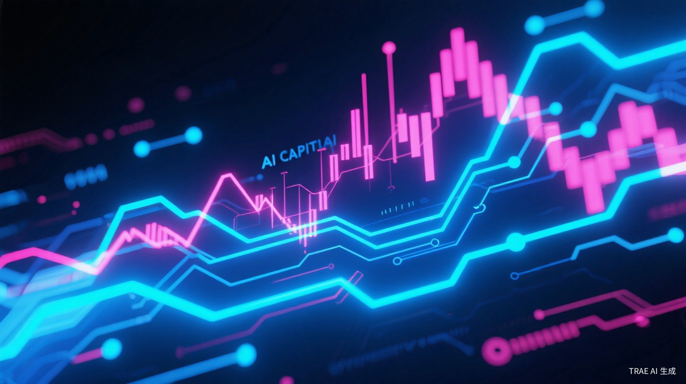

# AI三巨头同时IPO：资本超级周期来了

1999年互联网泡沫顶峰时，思科、英特尔、微软三家市值合计超过1.5万亿美元。当时没人觉得这是泡沫，直到两年后纳指跌去80%。

2026年6月，OpenAI、Anthropic、SpaceX同时推进IPO。三家公司估值加起来超过2万亿美元。历史不会简单重复，但押韵。

## 不是巧合，是周期

OpenAI估值8500亿美元，Anthropic 9650亿美元，SpaceX认购规模2500亿美元。三家公司，三条赛道，同一个时间点冲向二级市场。

这不是企业家们的默契，是VC们的集体焦虑。

过去三年，AI一级市场的钱太好拿了。OpenAI从微软拿了130亿美元，Anthropic从Google和亚马逊拿了76亿美元，SpaceX的星链烧了几百亿。但VC的钱不是无限的——基金周期通常7-10年，2021-2023年那波AI投资潮，现在到了该退出的时间点。

更关键的是，二级市场的AI叙事还在高位。英伟达市值3万亿美元，台积电2万亿美元，资本市场的AI热情还没退。对VC来说，现在IPO是最后的黄金窗口。再等一年，如果AI商业化不及预期，估值可能腰斩。

所以你看，Anthropic在IPO前夜紧急发布Claude Fable 5，定价降幅过半。SpaceX把火箭发射、星链、太空数据中心打包成"三大增长引擎"。OpenAI虽然嘴上说"上市时间未定"，但秘密递交申请本身就是在试探水温。

产品发布成了路演材料，技术突破成了估值支撑。这不是批评，是资本市场的正常逻辑。只是对普通投资者来说，分清楚"真技术"和"上市前包装"变得越来越难。

## 融资工具的进化：AI算力也能证券化

比IPO本身更值得关注的，是博通、阿波罗、黑石搞出来的那个350亿美元SPV。

SPV（特殊目的载体）不是新鲜东西，2008年金融危机就是它搞砸的。但把SPV用在AI算力基建上，这是第一次。

结构很精巧：60亿+240亿美元的高级债由博通信用背书，45亿次级债按8.5%票息出售，8亿股权由阿波罗旗下基金持有。三层结构，风险分级，把AI算力这种"重资产、长周期、高风险"的投资，包装成了不同风险偏好的金融产品。

这意味着什么？

以前，AI公司融资靠股权——稀释创始人股份，靠VC输血。后来有了债务融资，但利率高、条件苛刻。现在，通过SPV结构，AI算力可以被"证券化"—— pension fund买高级债，对冲基金买次级债，PE买股权。不同风险偏好的资本，都能找到适合自己的位置。

博通的CEO Hock Tan是玩并购和财务工程的高手。他敢给300亿美元高级债兜底，说明博通对AI芯片需求的长期信心。但这也意味着，AI算力的金融风险正在被系统性地转移和分散。如果未来AI需求放缓，这些结构化产品的底层资产价值会怎么变化？没人知道。

## 国内的镜像：科创板上的AI军备竞赛

OpenAI们在美国敲钟的同时，国内AI企业也在排队上市。

智谱华章拟科创板募资150亿元，120亿投入"人工智能通用基座大模型"。MiniMax启动A股IPO。燧原科技、粤芯半导体6月15日上会。一家比一家急。

但国内的问题更复杂。

首先是商业化。智谱的GLM模型技术不错，但To B收入能撑起150亿募资的回报预期吗？MiniMax的Talkie在海外有流量，但变现路径还不清晰。对比OpenAI的ChatGPT Plus已经有数千万付费用户，国内大模型的C端付费意愿明显弱一个档次。

其次是算力约束。燧原科技做AI芯片，但先进制程受限，性能差距客观存在。粤芯半导体做晶圆代工，但产线以成熟制程为主。上市募资可以扩产能，但技术瓶颈不是钱能解决的。

最微妙的是政策信号。科创板对AI企业的开闸，说明监管层认可AI的战略地位。但开闸之后，市场能不能接得住这么多AI概念股？2021年科创板芯片股的破发潮，很多人还没忘。

## 收割信号已经出现

CoreWeave的故事是一个警示。

这家AI数据中心运营商2025年3月上市，股价涨逾150%。然后三位联合创始人套现23亿美元，最大机构股东Magnetar抛售55亿美元。公司债务逼近250亿美元，还没实现单季度盈利。

华尔街分析师多数仍维持看多。但你看数据：高管减持、机构抛售、高负债、亏损、业绩指引不及预期。这些信号叠加在一起，像什么？

像2017年的比特币矿机公司，像2021年的SPAC概念股，像所有"赛道正确但基本面跟不上"的故事。

超微电脑也在走类似路径——70亿美元股权融资，盘后跌12%。市场在用脚投票：你可以讲故事，但稀释股权、增发股份，是要付出代价的。

这不是说AI基建没有价值。而是说，当赛道里的玩家开始大规模套现、开始靠股权融资维持现金流、开始用复杂的SPV结构转移风险时，说明这个赛道的"早期红利期"正在结束，"资本博弈期"正在开始。

---

## 参考来源

1. [Anthropic推出Claude Fable 5，SpaceX认购规模达2500亿美元](http://m.toutiao.com/group/7649552082038489626/)，每日经济新闻，2026年6月10日
2. [全球AI巨头竞速IPO 中国"军团"加速资本化布局](http://m.toutiao.com/group/7649436560311566882/)，证券日报，2026年6月10日
3. [AI News from June 10, 2026](https://creati.ai/ai-news/2026-06-10/)，creati.ai，2026年6月10日

<small>本文配图均来自Unsplash，遵循免费使用授权。</small>
