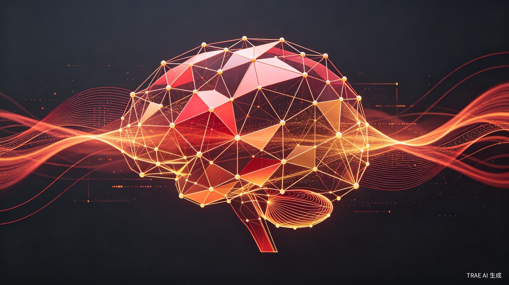

# 鸿蒙7不装App了，它要自己干活

6月12日，余承东在东莞松山湖发布了HarmonyOS 7。苹果WWDC刚收场，华为HDC无缝衔接，两家正面硬刚。但这次华为带来的不是"又一个iOS模仿者"——它直接把操作系统的底层逻辑改了。

## OS的底层逻辑变了

HarmonyOS 7引入了一个叫"Agent亲和系统架构"的东西。听起来很学术，翻译成人话就是：操作系统不再等着你点来点去，它自己能理解你想干什么，然后帮你干。

传统OS的逻辑是"你点一下，它动一下"。鸿蒙7的逻辑是"你说一句话，它跑完一整条链路"。比如你说"帮我找附近评分最高的火锅店，导航过去，到了买单"——小艺能自动调用美团搜店、高德导航、大众点评买单，全程不用你手动切App。

这套能力背后是HMAF 2.0（鸿蒙智能体框架2.0），复杂任务处理成功率提到90%以上。更重要的是，它首次向开发者开放了GUI操控能力——AI能"看懂"屏幕界面并直接操作，不需要每个App单独适配。

## 开源盘古2.0：不用英伟达的芯片训练出来的505B模型

余承东还放出了openPangu 2.0，分Pro和Flash两个版本。Pro版总参数505B，激活18B；Flash版总参数92B，激活仅6B。都采用稀疏MoE架构，512K上下文窗口。

有两个细节值得注意。第一，这套模型全程在昇腾芯片上训练，没用一块A100或H100。第二，余承东坦言"自己留的算力很有限"，因为大量算力支持了国内其他企业。单卡推理吞吐率是主流开源模型的2倍，这背后是华为对昇腾生态的深度调优。

6月30日起，预训练代码、后训练代码、训练算子等7大组件将陆续开源。

## 跟苹果正面刚

巧的是，苹果WWDC 2026和华为HDC 2026几乎同一时间举行。iOS 27推出了Siri AI，强调屏幕感知、个人上下文理解和App Intents。鸿蒙7走的是另一条路——不是在现有OS上叠加AI层，而是从内核层重构为Agent亲和架构。

两者的AI大脑也不同。苹果用的是Google定制的1.2T参数模型，年费10亿美元；华为用自研的openPangu 2.0，端侧就能跑盘古大模型，响应速度比云端快10倍以上。

小艺现在的数据：日均唤醒30亿次，日活跃服务1.8亿次，接入200+项系统级数据。这不是一个语音助手，这是一个已经跑在13亿台设备上的系统级Agent。

## 三张底牌

除了Agent化，HarmonyOS 7还补齐了三个底座。超丝滑方舟引擎首次搭载性能大模型，基于20亿+场景数据优化，应用启动提速22%，应用间跳转提速25%。鸿蒙星盾安全体系从被动拦截升级为主动防护，AI反诈能力覆盖变声检测、境外转打检测、风险二维码拦截，支付宝、抖音、京东、交行已接入。星河互联架构打通跨品牌设备壁垒，导航能在手机和多个品牌电动车车机间无缝流转。

说真的，过去两年手机AI功能多少有点"叫好不叫座"——demo很炫，买单的人不多。鸿蒙7能不能打破这个困局，关键看GUI操控开放后第三方应用的接入广度，以及小艺在真实场景中能不能稳定保持90%以上的成功率。

## 秋天见真章

HarmonyOS 7正式版秋季推送，恰好撞上华为Mate系列旗舰发布窗口。余承东放话今冬前鸿蒙终端设备破1亿——6600万的基础上，新系统+新旗舰+生态涌入，这个数字不是随便喊的。

6600万设备、1100万开发者、13亿生态设备、2000+AI Agent——当这四张牌握在一起的时候，余承东说"字典里没有第二，只有第一"，听着确实不像空话了。

---

## 参考来源

1. [IT之家 - 华为发布开源盘古2.0模型](https://www.ithome.com/0/963/480.htm)，2026年6月12日
2. [PConline - HarmonyOS 7全面拥抱Agent](http://m.toutiao.com/group/7650813151924519434/)，2026年6月13日
3. [DigitalTechByte - HarmonyOS 7 Agent-Friendly Architecture](https://digitaltechbyte.com/huawei-unveils-harmonyos-7-agent-friendly-architecture-ai-agents/)，2026年6月13日
4. [界面新闻 - HarmonyOS 7开发者Beta正式启动](https://m.jiemian.com/article/14582647.html)，2026年6月12日

<small>本文配图均来自Unsplash，遵循免费使用授权。</small>
