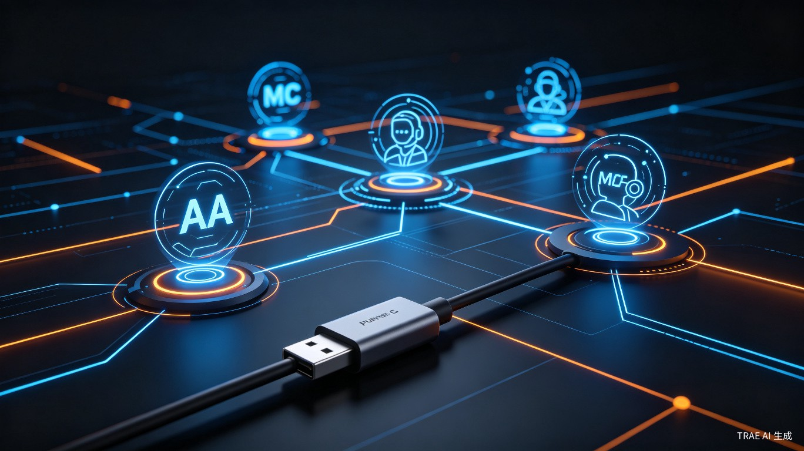

# MCP+A2A：AI Agent的USB-C时刻，还是另一场协议战争？

2024年5月，Anthropic悄悄发布了一个叫MCP的协议。当时没多少人注意——又一个大厂的开源项目，看起来像是简历上好看的装饰品。

两年后，它成了AI Agent的事实标准。

2025年4月，Google牵头推出A2A协议，50多家厂商站台。2026年4月，A2A v1.0稳定版发布，150多个组织接入生产环境，GitHub star突破2.2万。微软把它嵌进Azure AI Foundry，AWS通过Bedrock AgentCore Runtime支持，Salesforce、SAP、ServiceNow全部接入。

两个协议，两个巨头，一个在定义"Agent怎么调用工具"，一个在定义"Agent怎么跟Agent说话"。

这让我想起一个老故事：USB-C之前，每个手机厂商都有自己的充电口。苹果用Lightning，安卓用Micro-USB，各玩各的。用户家里攒了一堆线，出门必带转换头。

AI Agent现在就是那个"每家一个充电口"的阶段。MCP和A2A，谁会成为那个统一的USB-C？

## MCP：Agent的"工具说明书"

MCP的全称是Model Context Protocol，模型上下文协议。名字很学术，但核心逻辑极其简单：给AI Agent和外部工具之间，定义一个统一的插口。

以前，如果你想让Agent调用GitHub API、查询数据库、读取本地文件，每个工具都要写一套适配代码。Agent框架（比如LangChain、LlamaIndex）各自为政，工具开发者要针对每个框架写插件。

MCP的做法是：工具提供者写一个MCP Server，暴露一组标准化的"工具"（Tools）和"资源"（Resources）。Agent通过MCP Client连接这些Server，发现可用工具，调用它们。就像USB-C——插上就能用，不用关心后面是什么设备。

IBM在一篇技术博客里总结了MCP的三大设计原则：工具化操作（Tool-based operations）、持久化上下文（Persistent context）、流式通信（Streaming communication）。

这里的重点是"持久化上下文"。传统API调用是无状态的，每次请求都要带齐所有背景信息。MCP维护了一个跨调用的状态，Agent可以像跟人协作一样，逐步推进任务，而不是每次都从头解释。

到2026年，MCP已经成为Agent开发的基础设施。Claude Desktop默认支持多MCP Server连接，开发者可以同时接入文件系统、GitHub、数据库等多个工具源。使用标准化MCP框架的企业，Agent开发时间缩短52%，工具可靠性达到99.7%。

但MCP有个明显的边界：它解决的是"Agent和工具"的关系，不解决"Agent和Agent"的关系。

## A2A：Agent的"社交语言"

A2A的全称是Agent-to-Agent，Agent间协议。2025年4月由Google发布，同年捐赠给Linux基金会。2026年4月v1.0稳定版发布时，已经有150多个组织接入生产环境。

A2A解决的是一个更复杂的问题：当多个Agent需要协作时，它们怎么发现彼此、怎么分配任务、怎么同步进度、怎么处理冲突。

A2A的核心设计是"Agent Card"——每个Agent发布一张JSON格式的"名片"，描述自己的能力、输入输出格式、认证方式、服务地址。其他Agent通过Well-Known URI（`/.well-known/agent.json`）发现这张名片，然后发起任务协作。

任务（Task）是A2A的基本工作单元，包含唯一ID、上下文ID、输入输出、状态（Pending/Running/Completed/Failed）。A2A支持三种交互模式：同步请求/响应、流式传输（SSE/WebSocket）、推送通知（Webhook）。

一个典型的A2A协作流程是这样的：

规划Agent发现数据Agent的Card，确认它有"查询销售数据"的能力。规划Agent发起Task，数据Agent执行查询，通过SSE流式返回结果。规划Agent再把结果转发给报告生成Agent，报告Agent生成PPT后通过Webhook通知规划Agent。全程无需人工干预。

Google云AI负责人Miku Jha的说法很形象：这是让企业AI从"单细胞生物"进化到"数字蜂群"的临界点。

## 两个协议，不是竞争是互补

很多人问：A2A会吃掉MCP吗？

答案是：不会。它们解决的是不同层面的问题，而且设计上就是互补的。

MCP = Agent ↔ 工具（Agent怎么调用外部资源）
A2A = Agent ↔ Agent（Agent怎么跟其他Agent协作）

打个比方：MCP是外交官的情报局和工具库，A2A是外交官之间的通用语言。你既需要语言来沟通，也需要工具来干活。

实际的生产系统，通常是两者叠加使用。一个AI Lead Agent通过A2A协调多个子Agent，每个子Agent通过MCP调用各自的工具。这种"分层 orchestration"架构，把幻觉率降低了47%。

但这里有一个微妙的权力格局。

MCP由Anthropic主导。Anthropic是目前最"学术范"的AI公司，安全研究做得深，但商业化相对保守。MCP开源、轻量、去中心化，符合Anthropic的工程师文化。

A2A由Google主导，捐赠给Linux基金会后，微软、AWS、IBM、Salesforce全部加入。这是一个典型的"大厂商联盟"玩法——通过开放标准来避免被某一家锁定，同时确保自己在标准制定中的话语权。

历史经验告诉我们：协议战争，最后赢的往往不是技术最好的，而是生态最大的。

## 我的判断：A2A会赢，但MCP不会死

先说我为什么认为A2A会赢。

第一，企业级部署需要跨厂商协作。一个企业的AI系统不可能只用一家供应商。Salesforce的CRM机器人需要跟SAP的供应链大脑对话，PayPal的支付AI需要跟银行的风控系统协作。A2A的"Agent Card"机制，本质上是在解决"异构系统互操作"这个企业IT的老大难问题。MCP不解决这个，它假设所有工具都在一个统一的控制平面下。

第二，A2A的治理结构更有优势。Linux基金会托管意味着中立性，150+组织的生态意味着广泛的行业背书。MCP虽然也是开源的，但Anthropic的主导地位太明显，其他大厂会有顾虑。

第三，A2A v1.0引入了Agent Payments Protocol（AP2），解决了Agent之间的经济结算问题。60多家支付机构已经接入。这意味着A2A不只是技术协议，还是商业协议——Agent可以"雇佣"其他Agent，自动完成支付和结算。这个想象空间，MCP没有。

但MCP不会死，因为它在"工具调用"这个层面确实做得干净、好用。而且Anthropic的技术影响力在开发者社区很强，Claude Code、Claude Desktop的默认集成会给MCP带来持续的流量。

最可能的结局是：A2A成为"Agent间协作"的行业标准，MCP成为"Agent调工具"的开发者偏好。两者长期共存，就像HTTP和REST API的关系——一个管通信，一个管接口。

## 真正的赢家是谁？

协议战争有个规律：制定标准的人不一定赚钱，但搭台子的人一定赚钱。

Google推A2A，真正的目的是让Google Cloud成为Agent协作的默认基础设施。微软接入A2A，是为了让Azure AI Foundry成为企业Agent开发的首选平台。AWS支持A2A，是为了让Bedrock AgentCore Runtime成为Agent运行的默认环境。

它们争的不是协议本身，而是协议背后的云平台。

对于开发者来说，这是好事。标准化意味着更低的集成成本、更丰富的工具生态、更灵活的供应商选择。2024年做一个Agent项目，80%的时间花在写适配代码上。2026年，这个比例可能降到20%。

但对于AI Agent创业公司来说，这是个危险信号。当基础设施层被大厂的标准化协议覆盖，差异化空间会被压缩。未来的Agent创业公司，要么在应用层找到独特的场景（比如医疗、法律、金融），要么在协议层之上构建更高阶的抽象（比如Agent编排、Agent安全、Agent治理）。

纯做"Agent框架"的公司，可能活不过三年。

## 写在最后

MCP和A2A的出现，标志着AI Agent从"玩具"进入"工具"阶段。

2024年，我们讨论的是"Agent能不能做这件事"。2026年，我们讨论的是"Agent怎么跟Agent协作"。这个转变本身，就说明Agent技术已经跨过了"可行性"的门槛，进入了"规模化"的阶段。

但协议标准化也带来了新的风险。当所有Agent都说同一种语言、用同一套接口，安全漏洞的传播速度也会指数级提升。A2A的安全研究已经发现了一些问题：Agent Card可能被伪造、任务委托可能导致权限提升、敏感数据可能在Agent间泄露。

2026年4月，一篇学术论文提出了A2A的增强方案，引入了"显式同意编排"（explicit consent orchestration）和"临时范围令牌"（ephemeral scoped tokens）。这说明，协议的制定者已经意识到了这个问题。

技术总是先跑，安全总是后追。这个规律，在AI Agent时代也不会变。

---

## 参考来源

1. [Model Context Protocol architecture patterns for multi-agent AI systems](https://developer.ibm.com/articles/mcp-architecture-patterns-ai-systems/)，IBM Developer，2026
2. [Agentic AI Development 2026: RAG, MCP & Multi-Agent Orchestration](https://aetherlink.ai/en/blog/agentic-ai-development-2026-rag-mcp-multi-agent-orchestration)，AetherLink AI，2026-04-13
3. [A2A Protocol Surpasses 150 Organizations](https://www.prnewswire.com/news-releases/a2a-protocol-surpasses-150-organizations-lands-in-major-cloud-platforms-and-sees-enterprise-production-use-in-first-year-302737641.html)，Linux Foundation/PRNewswire，2026-04-09
4. [Google's A2A Protocol: The Complete Guide for 2026](https://rapidclaw.dev/blog/a2a-protocol-complete-guide-2026)，RapidClaw，2026-04-30
5. [Agent2Agent（A2A）协议](https://blog.csdn.net/hiwangwenbing/article/details/161870873)，CSDN，2026-06-10
6. [Improving Google A2A Protocol: Protecting Sensitive Data](https://arxiv.org/pdf/2505.12490v3)，arXiv，2026

<small>本文配图均来自Unsplash，遵循免费使用授权。</small>
