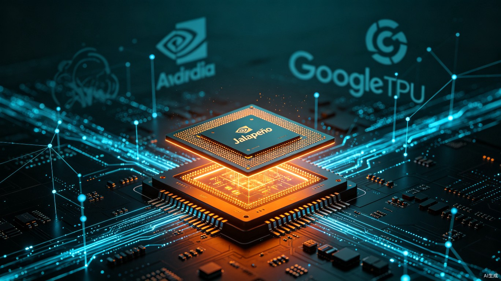

# OpenAI首款芯片Jalapeño：9个月流片，奥特曼亲手接过一颗"辣椒"

2026年6月24日，旧金山。

博通CEO陈福阳亲手将一颗芯片交给了OpenAI CEO萨姆·奥特曼。这颗芯片的名字叫Jalapeño——墨西哥辣椒。

从设计到流片，只用了9个月。创下AI芯片行业最快纪录。

这不是一颗通用GPU。这是一颗ASIC——专用集成电路，专为大语言模型推理设计。台积电3nm工艺。性能媲美英伟达Blackwell和谷歌TPU。每瓦性能显著优于当前最先进水平。推理成本降低约50%。

OpenAI把它定义为"智能处理器"（Intelligence Processor）。

一颗辣椒，烧穿了AI算力行业的旧秩序。

## 9个月，从白纸到流片

先说说这个时间线有多离谱。

传统芯片从设计到流片，通常需要2到3年。英伟达的Blackwell架构从立项到量产用了超过3年。谷歌TPU从概念到第一代流片也花了将近2年。

OpenAI和博通，9个月。

秘密在于分工方式。OpenAI负责底层架构设计——这是他们的核心 know-how，他们知道大模型推理到底需要什么。博通负责硅片实现与网络硬件——这是博通的老本行。加拿大电子制造服务商Celestica负责板卡与机架系统的集成。

三方各干各的擅长的事，没有互相扯皮。

更关键的是，OpenAI用了自己的AI模型来加速设计。也就是说，**跑在上面的AI，参与了设计它的芯片**。这不是营销话术——架构优化、布局布线、时序收敛，这些传统上需要大量人力的环节，AI工具的介入大幅压缩了迭代周期。

OpenAI硬件主管Richard Ho说得很直接："Jalapeño专门针对大语言模型进行优化，可以更快、更高效地运行支撑各类AI应用的模型。"

## 为什么是推理？为什么是现在？

Jalapeño的定位非常明确：只做推理，不做训练。

这是一个经过深思熟虑的战略选择。

训练芯片追求的是极致并行——把尽可能多的晶体管塞进单晶圆，用暴力并行度堆砌算力。英伟达的A100、H100、Blackwell都是这个路数。这条路的技术门槛极高，英伟达用20年建立的CUDA生态几乎不可撼动。

但推理完全不同。

推理的核心需求是**低延迟、高能效、高吞吐**。一个用户向ChatGPT提问，模型需要在几百毫秒内给出回答。这时候，芯片的能效比（每瓦性能）比峰值算力更重要。

更重要的是，**训练和推理的商业模式完全不同**。

训练是一次性投入——花几千万美元训一个模型，然后模型就固定了。推理是持续性支出——每服务一个用户、每处理一个查询，都要消耗算力。当ChatGPT每天有数亿次对话时，推理成本就是运营成本。

OpenAI的推理成本，此前几乎全部流向英伟达。每卖一张H100给OpenAI，英伟达赚将近3万美元。而现在，OpenAI要把这部分钱留给自己。

博通CEO陈福阳在接受路透社采访时说："Jalapeño的性能可与英伟达Blackwell芯片和谷歌TPU相媲美。"

这不是谦虚，这是宣战。

## 每瓦性能优于当前最先进水平

Jalapeño的工程样片已经在实验室中运行，测试对象是GPT-5.3-Codex-Spark。

OpenAI披露的早期测试数据显示，Jalapeño的每瓦性能"显著优于目前最先进的技术"。在同等算力输出下，运营成本可降低约50%。

这个数字怎么理解？

假设OpenAI每年在推理上的GPU采购和运维成本是100亿美元。如果Jalapeño能把这部分成本降低50%，那就是每年省50亿美元。而博通与OpenAI的合作规模据传达到100亿美元级别——这笔钱，OpenAI原本是要付给英伟达的。

Jalapeño采用了台积电3nm工艺（N3E世代），并使用3.5D XDSiP封装技术。这种封装方式把计算芯片和存储芯片垂直堆叠，大幅缩短了数据传输距离——对于推理任务中频繁读取模型参数的场景，这意味着更低的延迟和更高的能效。

OpenAI的架构设计还做了一件事：**减少数据传输，并平衡计算、内存和网络资源**。传统GPU的设计思路是"算力优先"，但实际推理场景中，大量时间浪费在数据搬运上。Jalapeño重新优化了计算、内存和网络之间的配比，让实际吞吐量更接近理论峰值。

这不是在英伟达的赛道上追赶，这是在另一条赛道上重新定义规则。

## 千亿瓦数据中心：OpenAI的算力野心

Jalapeño芯片只是OpenAI硬件战略的一部分。

OpenAI披露了一个更宏大的计划：2026年底，Jalapeño将规模化落地，配套建设**千兆瓦级数据中心**。

千兆瓦是什么概念？

一个大型核电站的装机容量大约是1吉瓦（1000兆瓦）。OpenAI计划建设的数据中心，耗电量相当于一个核电站。目前全球最大的数据中心集群——微软在亚利桑那州的数据中心——总功耗约为500兆瓦。OpenAI的计划是它的两倍。

这意味着什么？

意味着OpenAI不只是在做一颗芯片，而是在构建一套完整的**自有算力基础设施**。从芯片设计、制造、封装，到数据中心建设、电力供应、冷却系统，OpenAI正在打造一个垂直整合的算力帝国。

这个战略的逻辑很清晰：

**第一，摆脱英伟达依赖。** 此前OpenAI的算力几乎100%依赖英伟达GPU。一旦英伟达涨价、断供或产能不足，OpenAI就没有退路。自研芯片让OpenAI有了议价权——即使不完全替换英伟达，也能在谈判桌上多一张牌。

**第二，降低长期运营成本。** 推理成本是OpenAI最大的运营支出。如果自研芯片能把这部分成本降低50%，对利润率的提升是灾难性的（对竞争对手而言）。

**第三，定制化优势。** 通用GPU为了兼顾各种场景，做了很多OpenAI用不到的冗余设计。自研芯片可以只保留对大模型推理有用的部分，把每一分晶体管都用在刀刃上。

## 英伟达的黄昏？还为时过早

很多人看到Jalapeño的第一反应是"英伟达要完了"。

这个判断过于激进。

更准确的说法是：**英伟达在推理市场的垄断地位，第一次遇到了真正的挑战。**

但英伟达仍然有三大护城河：

**CUDA生态。** 20年积累的软件生态、开发者工具、优化库，不是一颗芯片能颠覆的。OpenAI虽然自己做芯片，但短期内不可能把全部推理负载迁移到Jalapeño上——软件迁移成本太高。

**训练市场的绝对优势。** Jalapeño只做推理，不做训练。而训练芯片的技术门槛和生态壁垒远高于推理。英伟达在训练市场的主导地位，短期内无人能撼动。

**客户多样性。** 英伟达的客户不只是OpenAI，还有谷歌、微软、Meta、亚马逊以及无数AI初创公司。即使OpenAI的自研芯片成功，英伟达仍然可以从其他客户那里获得巨额收入。

但Jalapeño的发布确实标志着一个拐点：**头部AI公司开始从"买芯片"转向"造芯片"**。

谷歌早在2016年就推出了TPU，现在已经是第四代。亚马逊有Trainium和Inferentia。微软据传也在与AMD合作开发定制芯片。OpenAI是最后一个加入这场游戏的大玩家，但可能是最有冲击力的一位——因为它有最大的推理负载、最强的技术团队、最充裕的资金。

当所有头部AI公司都开始自研芯片，英伟达的市场将从"垄断"走向"寡头竞争"。这对英伟达的利润率是长期利空。

## 我的判断：芯片即护城河

OpenAI发布Jalapeño，不只是技术事件，更是战略宣言。

它宣告了一件事：**在AI行业，模型能力和算力能力正在合二为一。**

过去，模型公司和芯片公司是上下游关系——OpenAI设计算法，英伟达提供算力。现在，OpenAI同时做两件事。因为最优的AI体验，来自算法和硬件的深度协同。

苹果是这个模式最成功的先例。A系列芯片和iOS的协同优化，让iPhone的体验长期领先安卓。谷歌也在走这条路——TPU和Gemini的协同。现在OpenAI加入了这场游戏。

对于行业的影响，我认为有三层：

**第一层，成本结构改变。** 自研芯片把推理成本降低50%，意味着AI应用的定价空间被打开。原来太贵而无法商业化的AI应用，现在变得可行了。

**第二层，竞争格局改变。** 拥有自研芯片的AI公司（OpenAI、谷歌、亚马逊），将相对于依赖第三方芯片的公司（Anthropic、大多数初创公司），获得结构性成本优势。

**第三层，产业链重构。** 当头部模型公司都开始自研芯片，博通、Marvell等ASIC设计服务商将成为新的受益者，而英伟达需要从"卖铲子"转向"卖方案"。

Jalapeño只是一颗芯片。但它代表的，是AI行业从"软件定义"走向"软硬件协同定义"的范式转移。

奥特曼接过那颗芯片的时候，接过的不仅是一个硬件产品，更是OpenAI通往万亿级公司的又一块拼图。

---

## 参考来源

1. [OpenAI发布首款AI芯片](https://m.yicai.com/brief/103244907.html)，第一财经，2026-06-25
2. [OpenAI发布首款定制AI推理芯片，披露多代计算平台计划](https://www.stcn.com/article/detail/3978450.html)，证券时报，2026-06-25
3. [OpenAI曝出第一颗芯片叫「辣椒」，AI自己设计，9个月流片](https://36kr.com/p/3867736555705603)，新智元/36氪，2026-06-25
4. [OpenAI、博通联手打造的AI芯片Jalapeño首秀，号称媲美英伟达](http://m.toutiao.com/group/7654952332421038632/)，IT之家，2026-06-25
5. [算力争夺战升级：OpenAI绕开英伟达、携手博通打造专属推理芯片](http://news.qq.com/rain/a/20260624A0AUHQ00)，腾讯新闻，2026-06-24
6. [OpenAI发布首款自研推理芯片Jalapeño，欲摆脱英伟达依赖](http://m.163.com/dy/article/L08KOEBU0550A7YJ.html)，网易，2026-06-25
7. [OpenAI首款推理芯片，能效甩开GPU，专攻吉瓦级集群](http://m.toutiao.com/group/7655021278906073636/)，科学剃刀，2026-06-25

<small>本文配图均来自Unsplash，遵循免费使用授权。</small>
