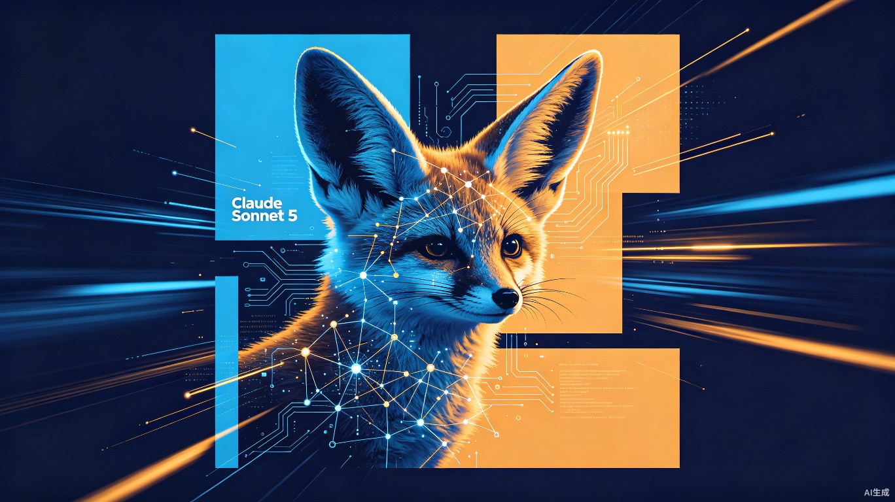

# Claude Sonnet 5：中端模型开始干旗舰的活了

Anthropic在6月30日深夜扔了个重磅：Claude Sonnet 5，内部代号Fennec，耳廓狐。

这名字有意思。耳廓狐是世界上最小的犬科动物，以速度和灵活著称。Anthropic给Sonnet 5选这个代号，意思很明确——不是最大的，但要当最快的。

从Sonnet 4.6直接跳到5，跳过了4.7和4.8，说明Anthropic自己都觉得这一代的提升不是小改款，是换代。

## 82%SWE-bench：中端模型第一次跑赢了老旗舰

SWE-bench是目前软件工程领域最权威的评测，测试AI模型解决真实GitHub Issue的能力。之前行业在77%到79%之间卡了很久，OpenAI的Codex、Anthropic自家的Opus 4.5都在这个区间。

Sonnet 5直接干到了82.1%，首次突破82%。

比数字更重要的是对比对象：这个成绩超过了Opus 4.5。一个中端模型，跑赢了上一代旗舰。

在另外两项关键测试中——BrowseComp（Agent搜索能力）和OSWorld-Verified（电脑操作能力）——Sonnet 5的表现也逼近当前的旗舰Opus 4.8。多家早期测试方反馈，以前Sonnet模型会半途而废的复杂任务，Sonnet 5能完整跑完，还会自己检查输出结果。

82%的开发者在Claude Code的盲测中选了Sonnet 5，主要原因是跨文件上下文保持能力明显增强。

## 价格砍了40%，能力反而升了

Sonnet 5的引入价：每百万输入Token 2美元，输出10美元。这个价格持续到8月31日，之后恢复为3/15美元。

对比一下：

- Opus 4.8：输入5美元，输出15美元
- Sonnet 5（标准价）：输入3美元，输出15美元
- Sonnet 5（引入价）：输入2美元，输出10美元

输出价格是Opus的三分之一，输入价格是五分之二。但Agent能力只差一点点。

Anthropic还做了一件事：把Sonnet 5设为Claude平台的默认模型，免费用户和Pro用户直接用，不需要手动切换。这意味着Anthropic在用自家最擅长Agent任务的中端模型，去承接最大规模的用户流量。

这个策略的潜台词是：**用中端模型打量产，用旗舰模型打标杆。**

## 三层架构：混合推理+蒸馏+TPU加速

Sonnet 5不是简单地把Opus的能力往下砍，而是用了一套全新的架构思路。

**混合推理**是第一层。模型能在快速直答和深度思考之间自动切换。写一个排序函数？直接出代码。修复一个跨5个文件的复杂Bug？先花时间分析调用链路，再动手改。用户不需要手动选择模式，模型自己判断。

**蒸馏推理**是第二层。先用旗舰级别的模型产出高质量推理数据，再用这些数据训练一个更小但更高效的模型。不是暴力压缩参数，而是迁移思维方式。这解释了为什么Sonnet 5参数量更小，但推理能力接近Opus。

**Antigravity协同**是第三层。Anthropic和Google合作，把Sonnet 5在TPUv6上做了深度优化。结果很夸张：200万Token上下文窗口（Opus 4.8只有100万），处理100万Token的延迟和当年Sonnet 3.5处理20万Token差不多。还有推测解码加速，首Token延迟接近即时。

三层叠加的效果是：**便宜、快、还聪明。**

## 新分词器的暗雷

有一个细节容易被忽略：Sonnet 5用了全新的分词器。

分词器决定了模型怎么切分文字。同样的内容，新分词器可能切出1到1.35倍的Token数量。这意味着你原来发一段1000 Token的文本，现在可能变成1100到1350 Token。

Anthropic说引入价已经考虑了这个因素，整体成本基本持平。但如果你的应用有Token计数的逻辑——比如显示剩余可用量、按Token计费——需要适配新的计数方式。这不是大问题，但容易踩坑。

## Claude Science：另一个值得关注的东西

和Sonnet 5一起发布的还有Claude Science，一个面向科研人员的AI工作台。

目前还是beta版本，核心功能是把几十个科研工具和数据库整合到同一个环境里。背后是一个统筹型主Agent，接入60多个预配置的科研技能和连接器——基因组学、蛋白质组学、结构生物学、化学信息学。还有一个审核Agent专门检查引用和计算过程。

几个内测案例很能说明问题：Allen Institute的神经科学家用它搭建了一套多Agent综述写作模板，子Agent负责通读论文、提取论点，评审Agent负责核查准确性。写一篇100页以上的综述，以前要两年，现在几个月能出10篇。

这个产品暴露了Anthropic的野心：不只是做通用AI，而是往垂直领域深度渗透。

## 我的判断：中端模型的旗舰化是不可逆的趋势

Sonnet 5的发布标志着一件事情：**中端模型开始具备独立完成复杂任务的能力，而不再只是旗舰模型的廉价替代品。**

这对行业的影响有三层：

**对开发者**：同样预算能跑更多Agent任务。以前用Opus才能搞定的事，现在用Sonnet 5就能做，成本降40%到60%。对于大量依赖API调用的AI应用——代码助手、文档分析、客服系统——这意味着利润率的直接提升。

**对 Anthropic**：用中端模型打大流量、用旗舰模型打高价值客户的分层策略，让它的商业模型更健康。免费用户和Pro用户用Sonnet 5，体验不差，成本可控；企业客户用Opus 4.8，效果更好，溢价合理。

**对竞争格局**：当Sonnet 5的Agent能力逼近Opus 4.8，而价格只有40%，OpenAI的GPT-5.6系列就面临一个尴尬的局面——中端价位上的竞争压力骤增。开发者不再需要为旗舰模型的溢价买单，因为中端模型已经够用了。

2026年下半年，AI模型竞争的关键词可能不是谁的参数多，而是**谁用更少的参数做出了足够好的智能**。

Sonnet 5给出了一个样本答案。

---

## 参考来源

1. [Anthropic深夜连放两弹：Sonnet 5、全新AI科研App重磅上线](https://tech.ifeng.com/c/8uOchPaNuAs)，凤凰网/AI寒武纪，2026-07-01
2. [Anthropic发布Claude Sonnet 5，性能逼近Opus 4.8、价格砍掉60%](http://m.toutiao.com/group/7657339659969724954/)，每日经济新闻，2026-06-30
3. [Claude Sonnet 5深度评测：Anthropic新一代Agentic编码模型的技术解构](https://blog.csdn.net/nmdbbzcl/article/details/162472410)，CSDN博客，2026-06
4. [Claude Sonnet 5 Changes Everything About Agentic Coding](https://www.mejba.me/blog/claude-sonnet-5-agentic-coding)，Mejba，2026-06
5. [Complete Guide to Claude Sonnet 5 (Fennec) for Software Engineering](https://chatgptaihub.com/claude-sonnet-5-fennec-software-engineering-guide)，ChatGPT AI Hub，2026-06
6. [Anthropic发布Claude Sonnet 5，性能逼近Opus 4.8、价格砍掉60%](http://m.toutiao.com/group/7657339659969724954/)，每日经济新闻，2026-06-30

<small>本文封面及内文配图均为AI生成。</small>
