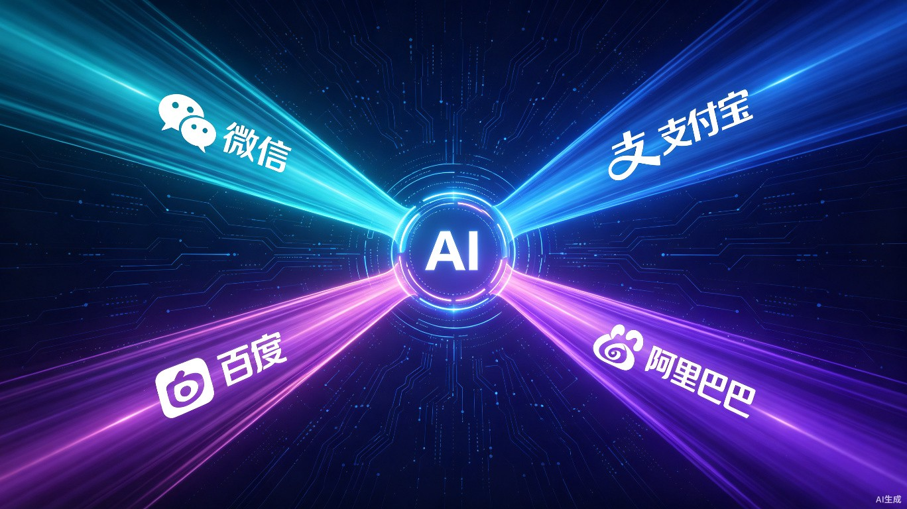

# 大厂AI大一统背后的技术架构：微信、支付宝、百度、阿里四条路线的拆解与对比



2026年6月到7月，中国互联网巨头们不约而同做了一件事：把散落在各处的AI能力，归拢到一个入口里。

微信内测AI助手"小微"，把点外卖、查快递、总结群聊塞进了聊天界面左上角的绿色小眼睛。支付宝推出"阿宝"，把上万个生活服务折叠进一个对话框，同时开放平台让商家一次接入就能覆盖手机、车机、AI眼镜。百度把文心一言、文小言、AI搜索、网盘、地图、文库全部合并成一个网站。阿里则以QoderWork为底座，把钉钉孵化的"悟空"和阿里云内部的"MuleRun"整合成统一的企业生产力平台。

四家公司，四种整合路径。表面看都是"入口归一"，但底层的技术架构选择截然不同。

## 问题定义：为什么大厂必须从赛马走向归一

AI大模型爆发后的两年里，大厂内部的AI产品布局可以用一个字概括：散。

百度有文心一言、文小言、AI搜索、百度网盘AI版、百度地图AI版、百度文库AI版——每个产品都有一个AI入口，但彼此之间数据不通、能力不共享、用户体验割裂。阿里更夸张，QoderWork、悟空、MuleRun、通义千问、钉钉AI助理，各自为政，内部赛马。

这种分散布局在探索期没问题——多团队并行试错，跑得快的留下。但当AI从玩具变成基础设施，用户不会接受"想用这个功能先找对App"的体验。更关键的是，每个分散的AI入口都在重复建设同一套底层能力：模型推理、用户画像、权限管理、数据存储。

归一化的本质，是用一套技术中台支撑所有前端入口，降低重复建设成本，同时给用户一个不用动脑的使用路径。

## 四条路线的架构拆解

```
┌─────────────────────────────────────────────────────────────────┐
│                    大厂AI整合四条路线对比                         │
├──────────┬──────────┬──────────┬──────────┬─────────────────────┤
│   维度   │   微信   │  支付宝  │   百度   │        阿里         │
├──────────┼──────────┼──────────┼──────────┼─────────────────────┤
│ 核心入口 │ 小微助手 │   阿宝   │ 文心官网 │     QoderWork       │
│ 整合范围 │ 小程序生态│ 生活服务 │ 全产品线 │  企业Agent工具      │
│ 技术路线 │ 程序化交互│ AHA多终端│ 统一站点 │ 前台+中台+后台     │
│ 模型策略 │ WeLM+DeepSeek│ 自研+开源│ 文心5.1  │ 通义千问           │
│ 目标场景 │ C端社交   │ C端生活  │ C端全能  │   B端生产力        │
└──────────┴──────────┴──────────┴──────────┴─────────────────────┘
```

## 微信：程序化交互路线的务实选择

微信的AI整合路径最有特色。它没有新建一个App，也没有做一个独立的AI网站，而是把AI助手直接嵌进了微信主界面——左上角加一个绿色小眼睛，右滑主界面就能唤起。

这个入口设计本身就传递了一个信号：微信不打算让AI成为独立产品，而是让它成为微信的一部分。

技术架构上，小微采用**主模型+兜底模型**的混合策略。主模型是微信自研的WeLM（WeChat Language Model），针对微信生态内的对话模式和小程序交互逻辑做了深度优化。部分复杂场景会调用DeepSeek协同处理。

WeLM的训练语料大量融入了微信特有的对话模式——群聊的碎片化表达、小程序的交互逻辑、公众号的内容结构。这种数据层面的生态内优化，是外部模型很难复制的壁垒。

但小微最有意思的技术选择是**对小程序的操控方式**。

行业内主流的Agent操控App有两种路线：一种是视觉模拟点击（比如豆包的做法），通过识别屏幕上的UI元素位置来模拟点击；另一种是程序化交互，通过调用小程序内部的接口来定位控件并触发操作。

微信选择了后者。程序化交互的精确度更高——位置、日期这类结构化参数填得很稳，不需要像视觉方案那样受分辨率、主题颜色变化的影响。但代价是适配成本高：每个小程序都需要暴露内部接口给小微调用，复合控件（筛选面板、座位选择器）的适配尤其复杂。

```
视觉模拟点击 vs 程序化交互
├─ 视觉模拟：识别屏幕像素位置 → 模拟点击
│   ├── 优点：无需App改造，通用性强
│   ├── 缺点：受分辨率/主题/弹窗干扰，稳定性差
│   └── 代表：豆包等外部Agent
├─ 程序化交互：调用内部接口 → 定位控件 → 触发操作
│   ├── 优点：精确度高，不受UI变化影响
│   ├── 缺点：需要App/小程序主动暴露接口
│   └── 代表：微信小微
└─ 微信的选择：后者，因为微信能要求小程序开发者配合改造
```

这个选择的背后有微信的生态话语权支撑。微信可以要求小程序开发者按照统一规范暴露接口，这是外部AI助手不可能做到的。

## 支付宝：AHA协议驱动的多终端分发架构

支付宝的AI整合是另一个极端。微信是把AI塞进一个App，支付宝是把一个AI助手 spread 到尽可能多的终端。

阿宝的核心技术设计是**AHA互联协议**（Alipay Hub Agent，推测命名）。这个协议的定位是一个中间层转换器——商家把现有的小程序、API服务接入平台后，AHA协议负责把这些服务能力翻译成不同终端能理解的格式。

```
支付宝AI开放平台技术架构
├─ 接入层：商家小程序/API → MCP/Skill/Agent能力转化
├─ 中间层：AHA互联协议（统一转换）
│   ├── 手机端：支付宝App内对话交互
│   ├── 车机端：语音优先的极简交互
│   ├── AI眼镜：视觉+语音多模态交互
│   └── IoT设备：传感器触发+语音反馈
├─ 能力层：模型托管 + 资源市场 + 分层计费
└─ 数据层：统一用户画像 + 跨端行为同步
```

AHA协议的价值在于**屏蔽终端差异**。商家不需要为手机、车机、AI眼镜分别开发三套AI服务，只需接入一次，AHA自动处理多终端的协议转换和交互适配。

这个架构的挑战在于**交互范式的差异**。手机上的对话框交互、车机上的语音优先交互、AI眼镜上的视觉叠加交互，对同一个服务的需求是完全不同的。AHA协议需要为同一套后端能力生成三种不同的前端交互模板，这个转换逻辑的复杂度不低。

支付宝的另一个技术赌注是**模型托管**。开放平台不仅提供接入协议，还提供模型托管服务——商家可以选择把自己的模型部署在支付宝的算力基础设施上。这意味着支付宝正在从支付平台向AI云服务平台扩展。

## 百度：统一站点的全场景覆盖策略

百度的整合路径最简单粗暴：把所有AI入口合并成一个网站。

6月25日，百度宣布文心一言、文小言、AI搜索、百度网盘、百度地图、百度文库等所有散落各处的AI服务，统一归拢到全新的百度文心网站。依托文心5.1大模型作为底层技术底座，一次性上线AI云盘、全格式Office在线编辑、定时任务等生产力工具。

从技术架构角度看，这是典型的**统一入口+能力中台**模式。

```
百度文心统一平台架构
├─ 前端：单一官网入口，覆盖学习/办公/生活/娱乐场景
├─ 中台：文心5.1大模型 + 多模态理解 + 搜索增强
├─ 后端：网盘/地图/文库/Office等垂直能力模块
└─ 数据层：百度搜索Index + 用户行为数据 + 知识图谱
```

百度的独特优势在于**搜索增强**。文心一言与百度搜索的深度整合意味着，模型在回答问题时可以直接调用百度搜索的实时索引，而不是仅依赖训练时的静态知识。这个能力在时效性问题上（比如"今天天气""最新股价"）有显著优势。

但统一站点模式也有隐忧。百度历史上多次尝试过"一个入口打通所有服务"（百度首页、百度App），结果往往是入口统一了，但每个垂直场景的体验都被稀释了。AI时代的统一入口能不能打破这个魔咒，取决于文心5.1的跨场景调度能力是否足够智能。

## 阿里：三层架构的企业Agent整合

阿里的AI整合是四家中最复杂的，因为整合对象不是C端产品，而是三个各自独立的企业级Agent产品。

QoderWork是桌面AI智能体，主打本地化执行和MCP协议（Model Context Protocol，模型上下文协议）。悟空是钉钉孵化的企业协同办公Agent，侧重组织内的工作流协同。MuleRun是阿里云内部的Agent执行引擎，专注于流程复用与执行。

三者的技术栈、用户群体、使用场景都不一样。阿里的整合策略是**三层架构融合**：

```
阿里统一生产力AI平台架构
├─ 前台：QoderWork（桌面交互层）
│   └── 统一用户界面，本地化执行，MCP协议对接
├─ 中台：MuleRun（引擎执行层）
│   └── 流程复用、任务调度、跨系统执行
└─ 后台：悟空（组织协同层）
    └── 企业组织架构、权限管理、协同工作流
```

这个分层设计的逻辑很清晰：用户通过QoderWork的桌面界面发起请求，MuleRun负责把请求翻译成可执行的任务流并调度执行，悟空负责在企业组织层面管理权限和协同关系。

MCP协议在这里扮演了关键角色。MCP是Anthropic推出的开放协议，旨在标准化AI模型与外部工具、数据源之间的交互。QoderWork基于MCP协议，意味着它可以对接任何支持MCP的第三方工具——不仅限于阿里自家的产品。

阿里的整合面临一个其他三家没有的挑战：**钉钉换帅后的战略一致性**。整合发生在钉钉换帅之后，由92年出生的新任钉钉CEO陈宇森统一操盘。年轻管理者+复杂产品线整合，这个组合的执行风险值得关注。

## 四条路线的技术Trade-off

| 维度 | 微信 | 支付宝 | 百度 | 阿里 |
|:---|:---|:---|:---|:---|
| **核心优势** | 小程序生态控制力 | 10亿用户+多终端覆盖 | 搜索实时增强 | 企业组织深度 |
| **技术壁垒** | 程序化交互接口规范 | AHA多终端协议 | 搜索Index+知识图谱 | MCP生态+钉钉组织 |
| **主要风险** | 小程序适配成本高 | 多终端交互范式差异大 | 垂直场景体验稀释 | 内部整合执行复杂度 |
| **模型依赖** | WeLM+DeepSeek | 自研+开源多模型 | 文心5.1独家 | 通义千问系列 |
| **数据资产** | 社交关系链+聊天数据 | 支付+生活服务数据 | 搜索行为+网页索引 | 企业协同+流程数据 |

从架构设计角度看，四家大厂的选择反映了各自的核心资产和战略优先级。

微信手握小程序生态，所以选择了**生态内深度集成**路线——AI不独立，而是增强现有生态。支付宝手握10亿用户和支付场景，所以选择了**多终端分发**路线——一个AI能力尽可能覆盖所有触点。百度手握搜索索引和网页数据，所以选择了**统一入口+搜索增强**路线——用实时信息弥补模型知识滞后。阿里手握钉钉的企业组织数据和B端客户，所以选择了**企业生产力整合**路线——AI服务于工作流程而非个人生活。

## 行业影响：AI入口战争的终局预判

大厂AI大一统的趋势，本质上是在为下一阶段的竞争卡位。

当AI能力同质化（各家模型差距在缩小），竞争的焦点会从"谁的模型更强"转向"谁的使用场景更封闭、数据飞轮转得更快"。微信的小程序生态、支付宝的生活服务数据、百度的搜索索引、阿里的企业流程数据，都是各自不可替代的数据护城河。

大一统整合的真正目的，不是给用户更好的体验——当然这也是副产品——而是让AI模型在各自的场景里吃到更多独家数据，形成"更多数据→更好模型→更多用户→更多数据"的飞轮。

从这个角度看，四条路线没有对错，只有适不适合各自的主场。

---

## 参考来源

1. [走出"赛马"试错期，大厂AI步入大一统](https://36kr.com/p/3884034614950534)，36氪，2026-07-08
2. [实测微信小微：一个"生在微信里"的AI，边界在哪里](http://m.toutiao.com/group/7659981133261619718/)，钛媒体，2026-07-08
3. [2026年6月微信亮出AI底牌"小微"](https://blog.csdn.net/techforward/article/details/162208933)，CSDN博客，2026-06
4. [支付宝AI开放平台正式上线](http://www.100ec.cn/detail--6661011.html)，网经社，2026-07-07
5. [支付宝与微信"AI化"，Token的账要和谁算](https://36kr.com/p/3878369957785860)，36氪，2026-07
6. ["一个网站搞定所有AI需求"：百度文心合并升级](https://net.blogchina.com/blog/article/477985953)，博客中国，2026-06-26
7. [百度打响AI入口统一战：文心5.1一站式整合](https://post.m.smzdm.com/p/apq2ezm7/)，什么值得买，2026-06-26
8. [突发！阿里AI产线大整合，92年陈宇森统管三大Agent](http://m.toutiao.com/group/7657911037097771555/)，智东西，2026-07-02
9. [阿里告别内部赛马：三大智能体合并](http://m.toutiao.com/group/7658232118220210688/)，亿执发，2026-07
10. [阿里拟整合QoderWork、悟空、MuleRun三大Agent产品](https://www.ithome.com/0/971/554.htm)，IT之家，2026-07-02

<small>本文配图使用AI生成，遵循CC0协议。</small>
