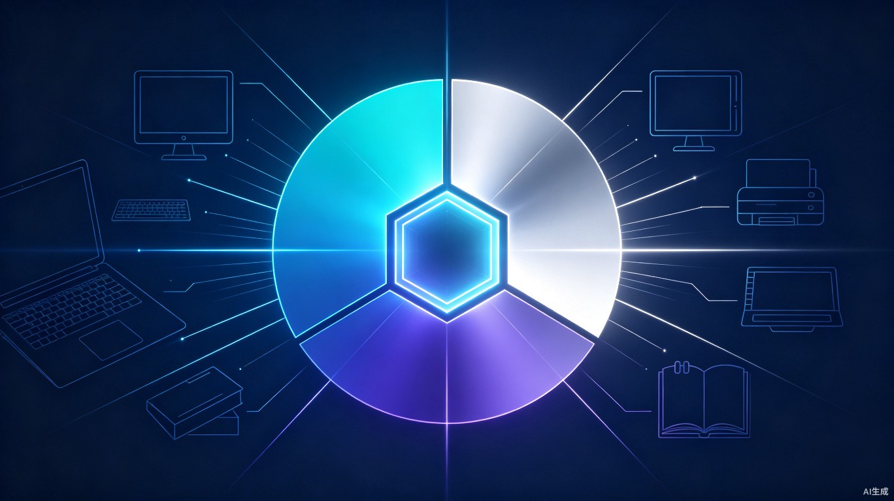

# ChatGPT Work技术架构拆解：Codex并入背后的三模式统一入口设计



2026年7月9日，OpenAI做了两件事：发布GPT-5.6系列模型，以及把独立运行近一年的Codex正式并入ChatGPT桌面端。

但Codex不是简单改了个名。OpenAI推出了一款新产品叫ChatGPT Work，把Codex背后那套接任务、读上下文、调用工具、分步骤执行的能力抽象出来，和原有的ChatGPT对话能力一起，塞进了一个统一入口。

现在的ChatGPT桌面应用里有三个模式：Chat负责聊天，Work负责通用办公任务，Codex负责编码开发。三个模式共享同一个模型底座，但调用不同的工具链和工作流。

这篇文章要拆解的是：这个三模式统一入口是怎么设计的，Codex并入的技术路径是什么，以及Work模式作为Agent到底能做什么、怎么做的。

## 产品架构：为什么是三模式，不是三应用

OpenAI原本有三条独立的产品线：ChatGPT（对话）、Codex（编码Agent）、Atlas（AI浏览器）。现在Atlas关了，Codex并了，只剩下一个桌面应用。

这个合并不是功能堆叠，而是能力分层。OpenAI的官方文档说得清楚：新版桌面应用提供Chat、Work、Codex三种模式，用户无需切换不同软件，即可完成日常对话、代码开发和长时间复杂任务。

```
ChatGPT桌面应用统一架构
├─ Chat模式：对话问答，通用知识交互
│   └── 调用：GPT-5.6 Sol/Terra/Luna
│   └── 能力：多轮对话、创意生成、信息检索
│
├─ Work模式：通用办公Agent
│   └── 调用：GPT-5.6 + 插件生态 + 内置浏览器 + 本地文件访问
│   └── 能力：任务拆解、计划制定、跨工具执行、成果交付
│   └── 输出：文档、表格、演示文稿、交互式网站（Sites）
│
└─ Codex模式：编码开发Agent
    └── 调用：GPT-5.6 + 代码仓库 + diff/review + 多仓库项目
    └── 能力：代码编写、bug修复、PR审查、架构重构
    └── 新增：inline editing within diffs、side panel PR review
```

三模式共享同一个GPT-5.6模型底座，但上层的工作流和工具链完全不同。Chat模式只需要对话能力，Work模式需要Agent编排能力，Codex模式需要代码理解和版本控制能力。

这种设计的核心逻辑是：模型底座统一，但使用场景分层。用户不需要为不同任务下载不同App，一个入口里根据需求切换模式即可。

## Codex并入的技术路径：能力抽象，不是功能搬家

Codex并入ChatGPT的过程，不是把Codex App里的代码原封不动搬过去。OpenAI做了一次关键的能力抽象。

Codex原本是一个完整的编码Agent，包含两部分能力：

**第一部分是通用Agent能力**——接任务、理解上下文、拆解步骤、调用工具、执行操作、交付结果。这部分能力不限于编码，可以泛化到任何需要多步骤执行的办公任务。

**第二部分是编码专用能力**——代码理解、仓库管理、diff分析、PR审查、多仓库项目协调。这部分是开发者专属。

OpenAI的选择是：把第一部分抽象出来，变成ChatGPT Work的底层引擎；第二部分保留在Codex模式里，继续服务开发者。

```
Codex能力拆分示意图
┌─────────────────────────────────────────────────────────────┐
│                    原始Codex Agent                           │
├────────────────────────────┬────────────────────────────────┤
│      通用Agent能力          │        编码专用能力             │
│  ├─ 任务理解与拆解          │  ├─ 代码语义理解               │
│  ├─ 上下文读取              │  ├─ 仓库结构解析               │
│  ├─ 工具调用编排            │  ├─ diff/PR review            │
│  ├─ 多步骤执行              │  ├─ 多仓库项目协调             │
│  ├─ 结果交付                │  ├─ inline editing            │
│  └─ 长时间任务保持          │  └─ 代码生成与重构             │
├────────────────────────────┴────────────────────────────────┤
│              ↓ 能力抽象与拆分 ↓                               │
├────────────────────────────┬────────────────────────────────┤
│   → ChatGPT Work引擎       │   → Codex模式（保留）          │
│   （通用办公Agent）          │   （开发者专用编码Agent）       │
└────────────────────────────┴────────────────────────────────┘
```

这个抽象的价值在于：Work模式不需要重新发明Agent能力，直接复用Codex打磨了近一年的任务执行引擎。Codex模式的编码专用能力也没有被稀释，反而因为和Work共享同一套UI框架而获得了更好的用户体验。

原有Codex用户的项目、配置和工作流全部无缝迁移。旧版客户端更名为ChatGPT Classic保留使用，给用户一个缓冲期。

## Work模式的核心Agent架构：从目标到交付的闭环

ChatGPT Work的定位是一个通用办公Agent。用户输入一个终极目标，Work自主拆解任务、制定计划、提取工具上下文、执行操作，最后生成可交付的成果。

整个工作流可以分成五个阶段：

```
ChatGPT Work任务执行流程
├─ 阶段1：目标输入
│   └── 用户用自然语言描述最终目标
│   └── 例："分析竞品A近三个月的产品迭代，生成对比报告"
│
├─ 阶段2：背景收集（Plan模式）
│   └── Work向用户提出问题，澄清需求
│   └── 自动读取本地文件、连接的工具中的相关上下文
│   └── 制定循序渐进的执行计划
│   └── 用户可修改计划或直接批准执行
│
├─ 阶段3：任务拆解与执行
│   └── 将大目标拆成可并行/串行的子任务
│   └── 调用内置浏览器搜索网页信息
│   └── 调用插件读取外部工具数据（Slack、Jira、Salesforce等）
│   └── 必要时登录账户、下载文件、填写表单
│   └── 跨标签页保持上下文，持续跟踪任务进度
│
├─ 阶段4：成果生成
│   └── 将收集的信息整合为结构化输出
│   └── 支持格式：文档、电子表格、演示文稿
│   └── Sites功能：生成可交互的Web应用/仪表盘
│   └── 遵循用户预设的模板和格式偏好
│
└─ 阶段5：交付与迭代
    └── 成果展示给用户审查
    └── 用户提出修改意见，Work迭代优化
    └── 支持周期性任务设置，持续监控更新
```

Plan模式是Work的一个关键设计。在执行之前，Work会先进入计划阶段，收集背景信息、提出澄清问题、制定执行计划。用户可以看到完整的计划并做出修改，确认后再启动执行。

这个设计的工程价值在于：**降低Agent的失控风险**。Agent自主执行长任务时，最危险的是理解偏差——模型以为自己理解了用户意图，实际跑偏了。Plan模式在执行前加入一个人工确认环节，把纠偏成本从执行后降到执行前。

另一个关键设计是**长时间任务保持**。Work可以盯着一个项目工作数小时，期间持续监控状态变化、处理异步事件、在关键节点向用户汇报进度。这要求Agent具备持久化状态管理能力和事件驱动架构，不是简单的单次请求-响应模式。

## 浏览器层的技术实现：三条腿走路

Work模式要执行办公任务，离不开网页浏览能力。OpenAI在浏览器层布局了三条技术路线：

```
ChatGPT浏览器技术三层架构
├─ 层1：桌面端内置浏览器（Built-in Browser）
│   ├── 运行环境：ChatGPT桌面应用内嵌
│   ├── 核心能力：多标签页、登录、自动填充、密码管理、下载、导航
│   ├── 用户可见：用户和ChatGPT看到同一个页面
│   ├── 适用场景：需要用户参与的交互（登录、确认、下载）
│   └── 状态隔离：使用独立的浏览器状态，与系统默认浏览器分离
│
├─ 层2：云端浏览器（Cloud Browser）
│   ├── 运行环境：OpenAI服务器端独立运行
│   ├── 核心能力：无需用户介入的自动化浏览、批量数据采集
│   ├── 用户不可见：在后台静默执行
│   ├── 适用场景：大规模信息检索、定时监控、自动化报表生成
│   └── 架构优势：不受用户本地网络/设备状态影响
│
└─ 层3：Chrome扩展（Browser Extension）
    ├── 运行环境：用户本地Chrome浏览器
    ├── 核心能力：针对当前浏览网页提问、总结、开启长任务
    ├── 交互方式：右键菜单/工具栏按钮唤起ChatGPT
    ├── 适用场景：浏览网页时的即时AI辅助
    └── 战略意义：覆盖不使用ChatGPT桌面应用的用户
```

内置浏览器解决的是**在ChatGPT应用内完成网页交互**的需求。当Work需要查资料、下载文件、登录第三方平台时，不需要跳出应用，在内置浏览器里就能完成。用户和AI看到同一个页面，AI可以指导用户操作，也可以自主操作。

云端浏览器解决的是**后台自动化**需求。有些任务不需要用户实时参与，比如每天自动抓取竞品价格、每周汇总行业新闻。这些任务放在云端浏览器里持续运行，结果完成后通知用户即可。

Chrome扩展解决的是**覆盖度**问题。不是所有人都会安装ChatGPT桌面应用，但几乎所有人都有Chrome浏览器。扩展程序让ChatGPT的能力延伸到用户日常的网页浏览场景中。

Atlas浏览器关停的原因也在这里——与其做一个新的浏览器去和Chrome/Edge/Safari竞争，不如把自己的AI能力嵌入到用户已经在用的浏览器里。这是从**产品竞争**转向**能力渗透**的战略调整。

## Sites功能：从自然语言到托管网站的技术工作流

Sites是ChatGPT Work里一个容易被低估的功能。它解决的是：AI生成的成果如何快速变成可分享、可交互的交付物。

传统工作流是：AI生成内容 → 用户复制粘贴到Word/PPT → 手动排版 → 导出PDF → 邮件发送。Sites把这个流程压缩成一步：自然语言描述需求 → AI生成可交互网站 → OpenAI托管部署 → 获得可访问的URL。

```
Sites技术工作流
├─ 输入层
│   └── 自然语言描述（"创建一个项目进度跟踪面板"）
│   └── 数据源连接（Google Sheets、Notion、Jira等）
│   └── 模板偏好（选择预设样式或自定义格式）
│
├─ 生成层
│   └── AI解析需求 → 确定页面结构（布局、组件、交互逻辑）
│   └── 生成前端代码（HTML/CSS/JS）
│   └── 数据绑定：将外部数据源映射到页面组件
│   └── 实时更新机制：数据源变化时自动刷新页面
│
├─ 托管层
│   └── OpenAI提供托管基础设施
│   └── 无需用户购买域名/云主机/配置CI/CD
│   └── 自动生成HTTPS可访问的URL
│   └── 权限管理：可设置公开访问或仅限团队
│
└─ 输出形态
    ├── 业务仪表盘（连接数据库的实时图表）
    ├── 项目跟踪器（任务状态、负责人、截止日期）
    ├── 发布日历（内容排期、状态流转）
    ├── 原型演示（可点击的交互原型）
    └── 数据报告（可筛选、可下钻的分析页面）
```

Sites的技术价值在于**消除了AI生成内容到可用产品之间的工程鸿沟**。以前AI能写代码，但用户不会部署；现在AI不仅写代码，还直接把代码跑起来，给一个能点击的链接。

从架构角度看，Sites是Work模式的一个输出通道。Work在执行任务过程中生成的结构化数据，可以通过Sites快速可视化和分享。这让Work从一个个人生产力工具，变成了一个团队协作工具。

## 插件生态与工具调用：1400+连接器的连接层设计

Work模式要真正有用，必须能连接到用户已经在用的工具。OpenAI的解决方案是插件生态——目前支持1400多款插件，覆盖从办公协作到数据分析的各个领域。

```
插件连接层架构
├─ 用户层：ChatGPT Work界面
│   └── 用户授权第三方工具访问权限
│   └── 选择要使用的插件组合
│
├─ 连接层：插件市场（1400+插件）
│   ├── 协作类：Slack、Notion、Jira、Asana、Trello
│   ├── CRM类：Salesforce、HubSpot、Pipedrive
│   ├── 数据类：Google Sheets、Excel、Airtable、PostgreSQL
│   ├── 办公类：Google Docs、Word、PowerPoint、PDF工具
│   ├── 通信类：Gmail、Outlook、Zoom、Teams
│   └── 开发类：GitHub、GitLab、Vercel、Figma
│
├─ 编排层：Agent任务调度
│   └── Work根据任务目标自动选择合适的插件
│   └── 多插件协同：从Jira读取任务 → 在Sheets分析 → 生成PPT报告
│   └── 上下文传递：前一个插件的输出作为后一个插件的输入
│
└─ 安全层：权限与数据隔离
    ├── 最小权限原则：只请求完成任务所需的权限
    ├── OAuth授权：用户明确授权后才可访问第三方数据
    ├── 数据不存储：插件访问的数据不永久存储在OpenAI服务器
    └── 用户可控：随时撤销插件权限
```

插件生态的本质是**把ChatGPT Work从一个封闭产品变成开放平台**。没有插件，Work只能处理本地文件和网页；有了插件，Work可以操作用户整个数字工作空间。

从工程实现角度看，插件系统需要解决三个技术问题：**标准化接口**（每个插件遵循统一的调用规范）、**上下文传递**（多个插件之间能共享数据）、**错误恢复**（某个插件调用失败时不影响整体任务）。OpenAI的解决方案是基于Function Calling机制——模型输出结构化函数调用指令，系统负责执行并返回结果。

## 三档模型与场景匹配：Sol、Terra、Luna的分工逻辑

ChatGPT Work的底层由GPT-5.6系列驱动，但三档模型的定位不同，和三种工作模式的搭配也有讲究。

| 模型 | 定位 | API定价（每百万Token） | 适用场景 | Work模式匹配 |
|:---|:---|:---|:---|:---|
| **Sol** | 旗舰版 | 输入5美元 / 输出30美元 | 复杂推理、代码攻坚、长时间专业工作流 | Codex模式首选，Work模式处理高难度任务 |
| **Terra** | 均衡版 | 输入2.5美元 / 输出15美元 | 日常办公、中等复杂度任务、性价比优先 | Work模式主力，大多数办公场景 |
| **Luna** | 轻量版 | 输入1美元 / 输出6美元 | 高频轻量任务、快速响应、成本敏感场景 | Chat模式首选，Work模式处理简单任务 |

三档模型的分工逻辑很像一个团队里的不同角色：Sol是资深专家，处理最难的问题；Terra是全职员工，承担日常主力工作；Luna是实习生，做简单快速的任务。

OpenAI官方的benchmark显示，Terra和Luna可以在大约1/16的成本下超过Claude Fable 5的性能。这意味着对于大多数日常办公任务，不需要调用最贵的Sol，Terra或Luna已经足够。

Work模式的智能之处在于**自动模型选择**。用户不需要手动切换模型，Work根据任务复杂度自动决定调用哪一档。写一封邮件用Luna，做一次竞品分析用Terra，做一次代码架构重构用Sol。

Prompt Caching是另一个降本关键。GPT-5.6支持更可预测的缓存机制，缓存读取有90%的折扣。对于需要反复读取同一份长文档或上下文的任务（比如盯着同一个项目工作数小时），缓存能大幅降低实际成本。

## 技术Trade-off与竞争格局

ChatGPT Work的架构设计反映了OpenAI对产品路线的几个关键判断：

**第一，超级入口优于垂直产品。** 把Chat、Work、Codex塞进一个应用，而不是做成三个独立产品。好处是用户切换成本低、数据共享顺畅；代价是应用体积变大、功能复杂度上升、不同用户群体的需求可能被相互拖累。

**第二，嵌入优于自研。** Atlas浏览器关停，转向Chrome扩展和内置浏览器。这承认了OpenAI在浏览器市场上没有竞争力，但AI能力可以渗透到任何浏览器里。

**第三，Agent能力泛化优于专用。** Codex的通用Agent能力被抽象成Work引擎，说明OpenAI认为编码Agent里磨练出的任务执行能力，可以迁移到更广泛的办公场景。

竞争对手这边，Anthropic的Claude走的是另一条路：强调高质量协作而非规模化调用。Claude没有推出类似Work的统一办公Agent，而是深耕编码工具（Claude Code）和对话体验。两条路线的差异在于：OpenAI追求的是**一个Agent干所有事**，Anthropic追求的是**一个Agent把一件事干到极致**。

从工程角度看，OpenAI的路线更难做。三模式统一入口的复杂度远高于单一产品，模式之间的状态同步、上下文传递、权限管理都是技术挑战。但如果做成了，用户粘性和数据飞轮的壁垒也会更高。

---

## 参考来源

1. [GPT-5.6全量放送，Codex正式并入ChatGPT](https://36kr.com/p/3889069642742403)，36氪，2026-07-10
2. [刚刚，GPT-5.6「太阳系」全家桶上线，Codex消失了](https://36kr.com/p/3889024357513736)，36氪，2026-07-10
3. [结束12天受限预览，GPT-5.6正式发布，Codex与ChatGPT合二为一](http://m.toutiao.com/group/7660692891844592162/)，DeepTech深科技，2026-07-10
4. [OpenAI连放两招，Codex被合并，新模型降价](http://m.toutiao.com/group/7660695815748469267/)，钱江晚报，2026-07-10
5. [OpenAI最强模型!GPT-5.6系列发布:Codex、ChatGPT Work智能体三合一](http://news.pconline.com.cn/2178/21784902.html)，太平洋科技，2026-07-10
6. [OpenAI宣布关闭AI浏览器Atlas，功能整合至ChatGPT桌面应用及Chrome扩展](https://tech.ifeng.com/c/8udaybJpPKK)，凤凰网科技，2026-07-10
7. [OpenAI旗下桌面浏览器ChatGPT Atlas即将被砍](https://www.ithome.com/0/974/788.htm)，IT之家，2026-07-10
8. [ChatGPT Work官方页面](https://openai.com/zh-Hans-CN/chatgpt-work/)，OpenAI，2026-07-10
9. [ChatGPT Release Notes](https://help.openai.com/en/articles/6825453-chatgpt-release-notes)，OpenAI Help Center，2026-07-10
10. [OpenAI推出企业级ChatGPT Work](http://m.toutiao.com/group/7660691871286542902/)，金融界，2026-07-10

<small>本文配图使用AI生成，遵循CC0协议。</small>
