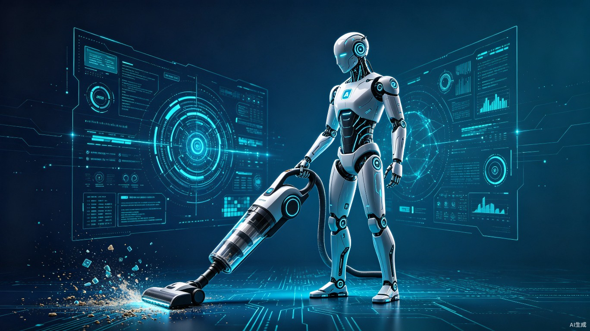

# 黄仁勋说AI就是吸尘器：一句话戳破了多少人的AI焦虑

黄仁勋最近说了一句大实话，结果很多人听完不淡定了。

在一场和LangChain创始人Harrison Chase的对谈里，有人问他怎么看AI智能体的拟人化。黄仁勋的回答很直接：

"这是电子，不是原子。这不是生物学上的。它没有意识。它是一个工具——有点像我的吸尘器。我们称它为洗碗机，它有点拟人化，但我们很清楚它是如何运作的。"

翻译一下：AI和你家的扫地机器人、洗碗机、吸尘器没什么本质区别。别把它当人看，它就是个工具。

这话从黄仁勋嘴里说出来，特别有意思。毕竟过去两年，全世界AI焦虑的最大推手之一，就是他自己。

## 一边制造焦虑，一边给你降温

黄仁勋这句话能引发这么大讨论，是因为它有一种微妙的撕裂感。

过去两年，黄仁勋在各种场合讲AI的故事，讲AI革命，讲每个行业都要被重构。他讲得越好，英伟达的股价涨得越高，大家的焦虑就越重。

程序员担心被取代，设计师担心被淘汰，文案策划担心饭碗不保，连医生律师都开始焦虑自己的职业会不会一夜之间没了。

结果焦虑最盛的时候，他站出来说：别慌，它就是个吸尘器。

你说这是良心发现？还是战略调整？

都不是。这是一个很聪明的信号——AI行业的叙事正在从"AI取代人类"转向"AI赋能人类"。

为什么要转？因为第一波AI焦虑的红利已经吃差不多了。大家从"哇AI好厉害"的新鲜感里走出来，开始进入"所以呢，到底能用来干嘛"的务实期。这时候继续贩卖焦虑，反而会引起反感。不如主动降温，把AI从一个让人害怕的东西，重新定位成一个让人想买的工具。

吸尘器的比喻，本质上是一次品牌公关。

## 但这句话，还真的有道理

抛开公关层面不谈，黄仁勋说的其实是对的。

AI到底是什么？往大了说，它是下一代计算平台。往小了说，它就是个效率工具。和计算器、搜索引擎、Excel表格没有本质区别——都是帮人更快地完成某类工作。

计算器没有取代数学家，搜索引擎没有取代研究员，Excel没有取代会计师。AI也一样。

问题在于，AI的"对话式交互"太像人了。你跟它说话，它用人类语言回答你，语气还挺像那么回事。于是大脑本能地把它当成一个"人"来对待，然后开始焦虑：这个人比我聪明，我怎么办？

但它不是人。它没有自我意识，没有情绪，没有欲望，没有创造力的那种"灵光一现"。它有的，是从海量数据里统计出来的概率分布。

你家吸尘器能帮你打扫卫生，比你自己扫还干净还快。你会焦虑自己被吸尘器取代吗？不会，因为你知道它只是个工具，你才是那个决定扫哪里、什么时候扫的人。

AI也是一样的。它能帮你写代码、写文案、做PPT、处理数据，但决定做什么、为什么做、做成什么样的，还是人。

## 可为什么我们还是这么焦虑

道理都懂，焦虑不减。为什么？

因为AI和吸尘器有一个本质的不同：吸尘器替代的是体力劳动，AI替代的是脑力劳动。而我们从小到大接受的教育，一直在告诉我们——体力劳动可以被替代，但脑力劳动是人的核心竞争力，是不可替代的。

结果现在发现，所谓的脑力劳动，很大一部分其实也是"套路劳动"。

写邮件有模板，做PPT有框架，写代码有模式，甚至写文章都有固定结构。这些事情看起来需要"思考"，但本质上是基于已有知识的组合和输出。而这恰恰是AI最擅长的。

所以真正的问题不是"AI会不会取代我"，而是"我做的工作，到底有多少是真正需要人的判断和创造力的，又有多少只是机械重复的脑力劳动"。

如果你的工作大部分是后者，那焦虑很正常。但焦虑的对象搞错了——不是AI的问题，是你的工作内容本身就容易被替代。没有AI，也会有外包、有标准化流程、有更便宜的年轻人。

AI只是加速了这个过程。

## 黄仁勋没说的那一半

黄仁勋说AI是吸尘器，只说了一半。

他没说的另一半是：吸尘器不会自己决定你家该不该打扫，不会自己决定买什么清洁剂，不会自己决定什么时候换地毯。但AI智能体正在朝"自己做决定"的方向走。

当AI不只是回答你的问题，而是主动帮你规划行程、管理日程、处理邮件、甚至做投资决策的时候，它还是一个"工具"吗？

工具的定义是：人控制工具，工具执行人的指令。

但如果工具开始自己"理解"你的需求、自己制定计划、自己调用其他工具，甚至自己纠正错误呢？这时候人和工具的边界就模糊了。

这不是科幻，这是正在发生的事。ChatGPT Work、阶跃星辰的Amoo、微信的小微、支付宝的阿宝——这些智能体已经不再是被动回答问题的工具了。它们在主动执行任务，在做小决策，在你看不到的地方运行着。

黄仁勋当然可以说它是吸尘器。因为从英伟达的角度，卖铲子的人永远希望大家把铲子当工具，而不是把铲子当竞争对手。

但站在用户的角度，当你的"吸尘器"开始自己决定什么时候打扫、打扫哪里、用什么方式打扫，甚至自己上网买清洁剂的时候，你真的还能把它当成一个普通工具吗？

## 真正应该焦虑的是什么

说实话，我觉得大多数人的AI焦虑，焦虑错了方向。

你不需要焦虑"AI会不会取代我"，你需要焦虑的是：

**第一，会不会用AI的人，差距会越来越大。** 同样是做方案，会用AI的人半天出三版，不会用的人三天出一版。差距不是AI和人的差距，是会用AI的人和不会用AI的人的差距。

**第二，AI拉低了很多行业的准入门槛。** 以前做设计要学PS、学审美、学构图，现在一句话就能出图。这意味着行业里的低端供给会爆炸式增长，价格会被压得很低。如果你只会做"AI也能做的那种水平的活"，那确实危险。

**第三，AI改变的不是岗位，是工作方式。** 没有哪个岗位会整个消失，但每个岗位的工作内容都会变。不变的那个部分，才是真正需要人的部分——判断、决策、审美、同理心、创造力。

黄仁勋说AI是吸尘器，是在给大家吃定心丸。但定心丸不能当饭吃。你可以把AI当工具，但前提是你得会用这个工具，而且要用得比别人好。

不然，你焦虑的不是AI取代你，而是会用AI的人取代你。

---

## 参考来源

1. [黄仁勋称AI与吸尘器同样都是工具，不要将其过度拟人化](https://www.ithome.com/0/972/253.htm)，IT之家，2026-07-13
2. [黄仁勋爆金句：AI不是人，是吸尘器！](https://m.sohu.com/a/1049852131_122066679/)，搜狐科技，2026-07-13
3. [黄仁勋：别把AI当"人"看](https://m.techweb.com.cn/article/2026-07-13/2977368.shtml)，TechWeb，2026-07-13
4. [黄仁勋称AI没有意识：本质是软件和工具 不要过度拟人化](http://m.toutiao.com/group/7661865578822418985/)，科创板日报，2026-07-13
5. [黄仁勋强调AI不应被过度拟人化](https://m.weibo.cn/detail/5320331145514426)，北京时间微博，2026-07-13
6. [AI智能体数量将超全球人口 智算经济规模预计突破30万亿](http://m.toutiao.com/group/7661920407389291042/)，中国工业报，2026-07-13
7. [阶跃星辰首款大模型原生智能体手机亮相](http://m.toutiao.com/group/7661986871480680995/)，澎湃新闻，2026-07-13
8. [共创未来 2026世界人工智能大会令人期待](http://www.xinhuanet.com/expo/20260714/e45e2d6dacd14de8a89116c978df6ebd/c.html)，新华网，2026-07-14
9. [豆包、千问下线智能体，AI拟人监管新规即将施行](http://m.toutiao.com/group/7662136142577402377/)，上观新闻，2026-07-14
10. [ChatGPT Work技术架构拆解：Codex并入背后的三模式统一入口设计](https://github.com/YeatsLiao/yeats-tech-blog)，夜知猩球，2026-07-10

<small>本文配图使用AI生成，遵循CC0协议。</small>
